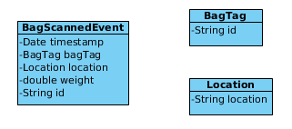

= CEP 实验
:toc: manual

== 实验目的及场景

通过实验去验证 Drools CEP 的基本概念及原理，包括： 时钟、比较运算符、事件、滑动窗口。实验场景是基于 CEP 构建机场包裹扫描系统。使用规则的目的是：

* 丢失包裹检测
* 托运行里时计算行里的重量
* 计算包裹平均的处理时间

==  Event/Fact 模型

* `BagTag` - 包裹的标记，在系统中唯一表识一个包裹
* `Location` - 包裹的位置，系统中包裹可能的位置有四个：CHECK_IN、SORTING、STAGING 和 LOADING
* `BagScannedEvent` - 包裹扫描事件，当包裹扫描时事件被执行，关联一个 `BagTag` 和一个 `Location`

[source, java]
.*BagTag.java*
----
public class BagTag implements Serializable {

	private static final long serialVersionUID = 1L;
	
	private final String id;
	
	public BagTag() {
		this(UUID.randomUUID().toString());
	}
	
	
	public BagTag(String id) {
		this.id = id;
	}
	
	public String getId() {
		return id;
	}
	
	@Override
	public String toString() {
		return this.id;
	}
}
----

[source, java]
.*Location.java*
----
public enum Location implements Serializable {

	CHECK_IN("check-in"), SORTING("sorting"), STAGING("staging"), LOADING("loading");
	
	private String location;
	
	private Location(String location) {
		this.setLocation(location);
	}

	public String getLocation() {
		return location;
	}

	public void setLocation(String location) {
		this.location = location;
	}
	
}
----

[source, java]
.*BagScannedEvent.java*
----
public class BagScannedEvent implements Serializable {

	private static final long serialVersionUID = 1L;
	
	private final String id;

	private Date timestamp;
	
	private final BagTag bagTag;
	
	private final Location location;
	
	private final double weight;
	
	public BagScannedEvent(BagTag bagTag, Location location, double weight) {
		this(bagTag, location, weight, new Date());
	}

	public BagScannedEvent(BagTag bagTag, Location location, double weight, Date eventTimestamp) {
		this(UUID.randomUUID().toString(), bagTag, location, weight, eventTimestamp);
	}

	public BagScannedEvent(String id, BagTag bagTag, Location location, double weight, Date eventTimestamp) {
		this.id = id;
		this.bagTag = bagTag;
		this.location = location;
		this.weight = weight;
		this.timestamp = eventTimestamp;
	}

	public Location getLocation() {
		return location;
	}

	public String getId() {
        return id;
    }

    public BagTag getBagTag() {
		return bagTag;
	}
	
	public double getWeight() {
		return weight;
	}

	public Date getTimestamp() {
		return timestamp;
	}

	public void setTimestamp(Date eventTimestamp) {
		this.timestamp = eventTimestamp;
	}

	@Override
	public String toString() {
		return new StringBuilder().append("Event:{").append("id: " + id).append("， bagTag: " + bagTag).append(", timestamp: " + timestamp).append(", location: " + location).append("}").toString();
	}

}
----

== 一：丢失包裹检测

*规则设计要求：* 设计规则检测如果一个包裹在通过 *CHECK_IN* 位置 10 分钟以后是否通过 *SORTING* 位置，如果否则说明规则丢失。

=== 定义事件

将 BagScannedEvent 定义为一个事件，可以通过多种方法去完成，例如在类 BagScannedEvent 上面添加标记：

[source, java]
----
import org.kie.api.definition.type.Expires;
import org.kie.api.definition.type.Role;
import org.kie.api.definition.type.Role.Type;
import org.kie.api.definition.type.Timestamp;

@Role(Type.EVENT)
@Timestamp("timestamp")
@Expires("1d")
public class BagScannedEvent implements Serializable {
----

link:src/main/resources/events.csv[src/main/resources/events.csv] 文件中定义了测试数据，共有 7 个 Event

[source, java]
----
Event:{id: 1， bagTag: 1, timestamp: Thu Jan 18 09:00:00 CST 2018, location: CHECK_IN}
Event:{id: 2， bagTag: 2, timestamp: Thu Jan 18 09:03:00 CST 2018, location: CHECK_IN}
Event:{id: 3， bagTag: 2, timestamp: Thu Jan 18 09:09:00 CST 2018, location: SORTING }
Event:{id: 4， bagTag: 3, timestamp: Thu Jan 18 09:11:00 CST 2018, location: CHECK_IN}
Event:{id: 5， bagTag: 3, timestamp: Thu Jan 18 09:14:00 CST 2018, location: SORTING }
Event:{id: 6， bagTag: 4, timestamp: Thu Jan 18 10:12:00 CST 2018, location: CHECK_IN}
Event:{id: 7， bagTag: 4, timestamp: Thu Jan 18 10:13:00 CST 2018, location: SORTING }
----

=== 编写规则

在机场包裹扫描系统中，如果一个包裹经过了 CHECK_IN，则 10 分钟后会在 SORTING 位置，否则系统认为包裹丢失，基于测试数据。规则判断的结果是 *包裹 1 丢失*。

[source, java]
----
rule "包裹在分类前丢失"
when
    $event1:BagScannedEvent(location == Location.CHECK_IN)
    // TODO-- 如果一个包裹经过了 CHECK_IN，则 10 分钟后会在 SORTING 位置，否则系统认为包裹丢失
then
    System.out.println("分类前丢失包裹: " + $event1.getBagTag().getId());
end
----

NOTE: 完成如上规则中 `TODO` 部分。

=== 执行规则

运行 link:src/main/java/com/sample/Rule1Main.java[Rule1Main.java] 可执行规则，规则运行输出：

[source, java]
----
分类前丢失包裹: 1
----

== 二：包裹数统计

编写规则统计最近一小时内经过 SORTING 位置的包裹总数。

=== 编写规则

使用 CEP 的一些概念编写规则，统计最近一小时内经过 SORTING 位置的包裹总数。

[source, java]
----
rule "最近一个小时通过 SORTING 的包裹总数"
when
    // TODO-- 使用 CEP 的一些概念编写规则，统计最近一小时内经过 SORTING 位置的包裹总数
then
    System.out.println("系统当前时间: " + drools.getWorkingMemory().getSessionClock().getCurrentTime() + "， 过去一个小时通过 SORTING 的包裹总数: " + $number );
end
----

NOTE: 完成如上规则中 `TODO` 部分。

=== 执行规则

运行 link:src/main/java/com/sample/Rule2Main.java[Rule2Main.java] 可执行规则，规则运行输出：

[source, java]
----
系统当前时间: 1516237200000， 过去一个小时通过 SORTING 的包裹总数: 0
系统当前时间: 1516237200000， 过去一个小时通过 SORTING 的包裹总数: 1
系统当前时间: 1516237200000， 过去一个小时通过 SORTING 的包裹总数: 2
系统当前时间: 1516237200000， 过去一个小时通过 SORTING 的包裹总数: 3
----

== 三：包裹重量统计

编写规则统计统计过去通过 CHECK_IN 的 5 个包裹的平均重量。

=== 编写规则

使用滑动窗口设计统计过去通过 CHECK_IN 的5 个包裹的平均重量。

[source, java]
----
rule "通过 CHECK_IN 的连续 5 个包裹的平均重量"
when
    // TODO--
then
    System.out.println("系统当前时间: " + drools.getWorkingMemory().getSessionClock().getCurrentTime() + "， 过去通过 CHECK_IN 的连续 5 个包裹的平均重量: " + $number );
end
----

NOTE: 完成如上规则中 `TODO` 部分。

=== 执行规则

运行 link:src/main/java/com/sample/Rule3Main.java[Rule3Main.java] 可执行规则，规则运行输出：

[source, java]
----
系统当前时间: 1516237200000， 过去一个小时通过 SORTING 的包裹总数: 0
系统当前时间: 1516237200000， 过去通过 CHECK_IN 的连续 5 个包裹的平均重量: 0.0
系统当前时间: 1516237740000， 过去一个小时通过 SORTING 的包裹总数: 1
系统当前时间: 1516237740000， 过去通过 CHECK_IN 的连续 5 个包裹的平均重量: 17.2
分类前丢失包裹: 1
系统当前时间: 1516238040000， 过去一个小时通过 SORTING 的包裹总数: 2
系统当前时间: 1516238040000， 过去通过 CHECK_IN 的连续 5 个包裹的平均重量: 15.899999999999999
系统当前时间: 1516241520000， 过去一个小时通过 SORTING 的包裹总数: 1
系统当前时间: 1516241580000， 过去一个小时通过 SORTING 的包裹总数: 2
系统当前时间: 1516241580000， 过去通过 CHECK_IN 的连续 5 个包裹的平均重量: 17.2
----

=== KieSession EventListener

添加 EventListener 记录规则执行 Agenda 及 Runtime 状态。

== 四：统计包裹从 CHECK_IN 到 SORTING 的平均时间

包裹扫描系统需要统计过去 5 个连续的包裹从 CHECK_IN 到 SORTING 的平均处理时间。

=== 编写规则

[source, java]
----
rule "5 个连续的包裹从 CHECK_IN 到 SORTING 的平均处理时间"
when
    // TODO--
then
    System.out.println("个连续的包裹从 CHECK_IN 到 SORTING 的平均处理时间: " + $number);
end
----

NOTE: 完成如上规则中 `TODO` 部分。

=== 执行规则

运行 link:src/main/java/com/sample/Rule4Main.java[Rule4Main.java] 可执行规则，规则运行输出：

[source, java]
----
5 个连续的包裹从 CHECK_IN 到 SORTING 的平均处理时间: 200000.0
----

== 五：平均时间统计进一步完善

5 个连续的包裹从 CHECK_IN 到 SORTING 的平均处理时间实现比较负责，例如在 SORTING 中存在的包裹则需要确保 CHECK_IN 也存在次包裹。本部分进一步完善此规则。

== 六：Entry Point 插入事件

编辑规则可以获取不同位置的包裹。

=== 编写规则

[source, java]
----
rule "CheckIn 的包裹"
when
        $event:BagScannedEvent() from entry-point "CheckIn"
then
        System.out.println("CheckIn 的包裹: " + $event);
end

rule "Sorting 的包裹"
when
        $event:BagScannedEvent() from entry-point "Sorting"
then
        System.out.println("Sorting 的包裹: " + $event);
end

rule "Staging 的包裹"
when
        $event:BagScannedEvent() from entry-point "Staging"
then
        System.out.println("Staging 的包裹: " + $event);
end
----

=== 执行规则

运行 link:src/main/java/com/sample/Rule6Main.java[Rule6Main.java] 可执行规则，规则执行过程中 Event insert 逻辑如下：

[source, java]
----
        switch(location) {
        case CHECK_IN :
            kieSession.getEntryPoint("CheckIn").insert(event);
            break;
        case SORTING :
            kieSession.getEntryPoint("Sorting").insert(event);
            break;
        case STAGING :
            kieSession.getEntryPoint("Staging").insert(event);
            break;
        case LOADING :
            kieSession.getEntryPoint("Loading").insert(event);
            break; 
        default:
            throw new IllegalArgumentException("Unexpected location.");
        }
----

== 七：包裹匹配

编写规则是实现包裹匹配，包裹事件来自不同的流。

=== 编写规则

[source, java]
----
rule "包裹匹配"
when
    //TODO--
then
    System.out.println("发现了一个包裹经过 CHECK_IN 和 SORTING: " + $event1.getBagTag().getId());
end
----

NOTE： 补充 TODO-- 部分。

=== 执行规则

运行 link:src/main/java/com/sample/Rule7Main.java[Rule7Main.java] 可执行规则，执行输出结果如下：

[source, java]
----
All events:
    Event:{id: 1， bagTag: 1, timestamp: Thu Jan 18 09:00:00 CST 2018, location: CHECK_IN}
    Event:{id: 2， bagTag: 2, timestamp: Thu Jan 18 09:01:00 CST 2018, location: CHECK_IN}
    Event:{id: 3， bagTag: 3, timestamp: Thu Jan 18 09:03:00 CST 2018, location: CHECK_IN}
    Event:{id: 4， bagTag: 2, timestamp: Thu Jan 18 09:04:00 CST 2018, location: SORTING}
    Event:{id: 5， bagTag: 1, timestamp: Thu Jan 18 09:11:00 CST 2018, location: SORTING}
    Event:{id: 6， bagTag: 3, timestamp: Thu Jan 18 09:12:00 CST 2018, location: SORTING}
    Event:{id: 7， bagTag: 4, timestamp: Thu Jan 18 09:33:00 CST 2018, location: CHECK_IN}
    Event:{id: 8， bagTag: 5, timestamp: Thu Jan 18 09:35:00 CST 2018, location: CHECK_IN}
    Event:{id: 9， bagTag: 4, timestamp: Thu Jan 18 09:44:00 CST 2018, location: SORTING}
    Event:{id: 10， bagTag: 5, timestamp: Thu Jan 18 09:44:30 CST 2018, location: SORTING}
发现了一个包裹经过 CHECK_IN 和 SORTING: 2
发现了一个包裹经过 CHECK_IN 和 SORTING: 1
发现了一个包裹经过 CHECK_IN 和 SORTING: 3
发现了一个包裹经过 CHECK_IN 和 SORTING: 4
发现了一个包裹经过 CHECK_IN 和 SORTING: 5
----

== 八：事件过期

本部分测试 CEP 中事件过期属性。

[source, java]
.*设定 BagScannedEvent 事件过期事件为 10 分钟*
----
@Role(Type.EVENT)
@Timestamp("timestamp")
@Expires("10m") // "1d"
public class BagScannedEvent implements Serializable {
----

[source, java]
.*实现 DefaultRuleRuntimeEventListener，当事件删除后打印输出*
----
public class LoggingRuleRuntimeEventListener extends DefaultRuleRuntimeEventListener {

    @Override
    public void objectDeleted(ObjectDeletedEvent event) {
        System.out.println("Event deleted from WorkingMemory: " + event.getOldObject());
        System.out.println("Number of facts in session: " + event.getKieRuntime().getFactCount());
    }

}
----

运行 link:src/main/java/com/sample/Rule8Main.java[Rule8Main.java] 可执行规则，执行输出结果如下：

[source, java]
----
Event deleted from WorkingMemory: Event:{id: 1， bagTag: 1, timestamp: Thu Jan 18 09:00:00 CST 2018, location: CHECK_IN}
Number of facts in session: 3
----

== 九：时间运算符丢失包裹检测

在 <<一：丢失包裹检测, 一：丢失包裹检测>> 部分我们设计规则进行了丢失包裹检测，本部分通过时间运算符重新设计规则。

=== 编写规则

[source, java]
----
rule "丢失包裹检测"
when
    //TODO--
then
    System.out.println("丢失包裹: " + $event1.getBagTag().getId());
end
----

NOTE： 补充 TODO-- 部分。

=== 规则执行

运行 link:src/main/java/com/sample/Rule9Main.java[Rule9Main.java] 可执行规则.

使用如下步骤调示：

* To inspect the behaviour of Drools, set a breakpoint on line 519 of the ObjectTypeNode class. Expiration offsets are defined on the ObjectTypeNode of a given object. This is especially interesting to know when using subclassing in your events. I.e. when you have an event that matches 2 ObjectTypeNodes, one for its superclass and one for its subclass, 2 expiry actions are scheduled, one per OTN.
* To further inspect the behaviour, also set a breakpoint on line 92 of the PropagationEntry interface. This is the line of the Insert PropagationEntry that gets executed when a fact/event is inserted into the engine.
* When we now run the Main class in debug-mode, we can see that the expiration-offset on the OTN gets set when the network is created.

