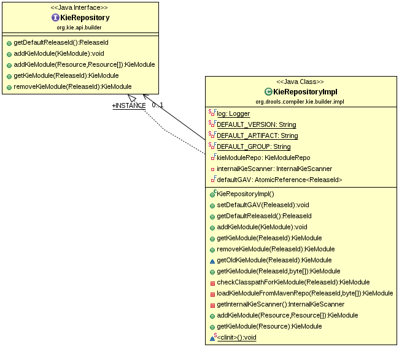
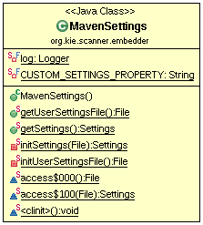
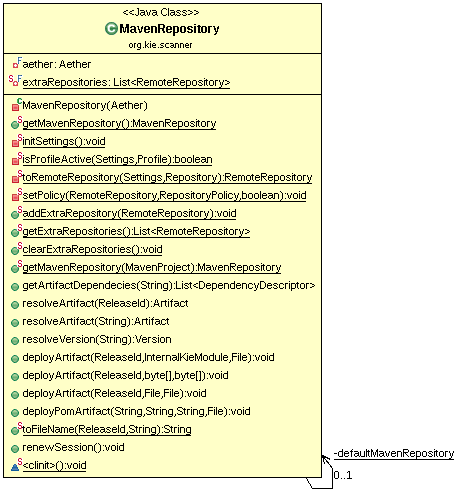

* KieModule 是一个容器，包含定义 KieBase 所需要的所有资源，这些资源可以定义多个 KieBase，我们有 kmodule.xml 文件来定义一个 KieModule，kmodule.xml 文件中 KieBase 名字的申明，配置，及相关 KieSession 的申明。相关的类实现如下：

* KieRepository 是一个单例的实体，它的角色是一个仓库，这个仓库中保存着所有的 KieModule，通常 KieModule 从远程的 Maven仓库中获取，KieRepository 也提供了相关的接口，用于通过API添加或删除KieModule。相关的类实现如下：

* KieScanner 是一个扫描器，它能够扫描 maven 仓库，它用来自动发现一个新的 KieModule 的发布，如果 KieModule 有新版本发布，KieScanner会扫描发现它，并自动更新 KieRepository，使其与 maven 仓库保持一致。start(long pollingInterval)方法开始扫描，且每次扫描的时间间隔为pollingInterval；stop()方法是停止扫描；scanNow()开始同步扫描。相关的类实现如下：

* Maven 整合相关
  1）定义 kie.maven.settings.custom 指定 Maven 配置文件 settings.xml
  2) 到当前用户下找 .m2/settings.xml
  3）到 M2_HOME 下找 /conf/settings.xml

MavenSettings 用来获取 Maven 的 settings.xml 配置文件，如下类图：

如上 getSettings() 方法获取 `org.apache.maven.settings.Settings` 对象实例。MavenRepository 用来根据 ReleaseId 获取远程 Maven 中相关 Project 的发布包，也就是我们所说的 Kjar，一个Kjar包含一个 KieModule。MavenRepository 相关的类实现如下：

如上图，resolveArtifact() 方法获取 `org.sonatype.aether.artifact.Artifact`，该对象包括同步到本地的远程 Maven 中相关 Project 的发布包，该方法需要传入 ReleaseId，如下代码执行

~~~
ArtifactResult artifactResult = aether.getSystem().resolveArtifact(aether.getSession(), artifactRequest);
~~~

会下载远程 Project 发布包，会输出如下信息：

~~~
wagon http use multi threaded http connection manager maxPerRoute 20, max total 40
~~~

