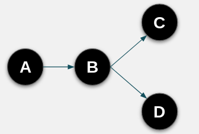

= PHREAK 算法
:toc: manual

== Drools 集成开发环境安装

*1 - 下载*

点击 https://developers.redhat.com/download-manager/file/devstudio-12.0.0.GA-installer-standalone.jar 下载 JBDS。

*2 - java -jar <JAR> 安装*

[source, java]
----
$ java -jar devstudio-11.3.0.GA-installer-standalone.jar 
----

运行如上命令在安装 Wizard 中接收软件安装许可证，以及选择安装路径，其余所有选项采用默认安装。

*3 - 安装 Drools 集成开发环境*

JDBS 启动后，在 `Red Hat Centrl` 底部选择 `Software/Update`，在新页面中选择 `JBoss Business Process and Rule Development` 后点击 *Install/Update*

image:img/rhdm-drools-plugin.png[]

安装完成后需要重启 JBDS。

== PHREAK 语法树

=== Alpha 节点

判断如下规则的语法树形状。

[source, java]
----
rule "Sample Rule 1"
    when
        $c: Customer(age > 30, category == Category.GOLD)
    then
        System.out.println($c);
end

rule "Sample Rule 2"
    when
        $c: Customer(age > 30, category == Category.SILVER)
    then
        System.out.println($c);
end
----

如果调整 `Sample Rule 2` 中 Pattern 为 `$c: Customer(category == Category.SILVER, age > 30)` 语法树是否有变化？

=== Beta 节点

判断如下规则的语法树形状。

[source, java]
----
rule "Sample Rule 1"
    when
        $p: Provider(rating > 50)
        $pr: ProviderRequest(provider == $p)
    then
        System.out.println("Y");
end

rule "Sample Rule 2"
    when
        $p: Provider(rating > 50)
        $pr: ProviderRequest(provider == $p)
        $o: Order()
    then
        System.out.println("Y");
end
----

如果将 `Sample Rule 2` 中 Pattern 变换位置为如下，则语法树是否有变化？

[source, java]
----
$p: Provider(rating > 50)
$o: Order()
$pr: ProviderRequest(provider == $p)
----

=== 会员等级规则语法树构建

分析如下规则，构建语法树。

[source, java]
----
rule gold_account
salience 200
when
  account: Account()
  Number(this >= 50000) from accumulate(t: Transaction(source == account); sum(t.amount))
  Number(this >= 50000) from accumulate(t: Transaction(target == account); sum(t.amount))
then
  //System.out.println("Gold account: " + account);
end

rule silver_account
salience 100
when
  account: Account()
  Number(this >= 25000 && this < 50000) from accumulate(t: Transaction(source == account); sum(t.amount))
  Number(this >= 25000 && this < 50000) from accumulate(t: Transaction(target == account); sum(t.amount))
then
  //System.out.println("Silver account: " + account);
end

rule bronze_account
salience 50
when
  account: Account()
  Number(this >= 10000 && this < 25000) from accumulate(t: Transaction(source == account); sum(t.amount))
  Number(this >= 10000 && this < 25000) from accumulate(t: Transaction(target == account); sum(t.amount))
then
  //System.out.println("Bronze account: " + account);
end
----

== PHREAK Vs RateOO

本部分通过实验验证 PHREAK 和 RateOO 算法的执行速率。

*性能测试工具*

http://openjdk.java.net/projects/code-tools/jmh/[OpenJdk： jmh]

*测试代码*

https://github.com/kylinsoong/drools-examples/tree/master/benchmark[点击下载测试代码]

*测试规则*

* grouping.drl     -  面向集合的传播(Set-oriented propagation)
* laziness3.drl    -  延迟规则评估
* laziness6.drl    -  延迟规则评估
* modification.drl -  规则执行控制

每个规则使用不同的算法执行，执行模拟处理不同数量的 Transaction：

* 10 个 Transaction - 大于 10 000 个 Fact
* 100 个 Transaction - 大于 100 000 个 Fact 
* 1000 个 Transaction - 大于 1 000 000 个 Fact

*运行性能测试对比程序*

[source, java]
----
$ mvn clean install
$ java -jar target/benchmark.jar
----

为了节省执行时间，可以注释掉 Insert 1 000 000 个 Fact 的测试，具体编辑 Benchmark.java，修改 numOfTransactions 的 @Param 为 `@Param({ "10", "100"})`。

*执行结果*

执行结束会有如下统计数据：

[source, java]
----
Benchmark                        (numOfTransactions) (ruleEngine)   Mode   Samples        Score  Score error    Units
o.k.e.p.Benchmark.grouping                        10       phreak   avgt       200        0.493        0.007    ms/op
o.k.e.p.Benchmark.grouping                        10       reteoo   avgt       200        1.056        0.006    ms/op
o.k.e.p.Benchmark.grouping                       100       phreak   avgt       200        3.054        0.021    ms/op
o.k.e.p.Benchmark.grouping                       100       reteoo   avgt       200        8.210        0.050    ms/op
o.k.e.p.Benchmark.grouping                      1000       phreak   avgt       200       26.705        0.210    ms/op
o.k.e.p.Benchmark.grouping                      1000       reteoo   avgt       200       77.232        0.379    ms/op

o.k.e.p.Benchmark.laziness3                       10       phreak   avgt       200        0.746        0.006    ms/op
o.k.e.p.Benchmark.laziness3                       10       reteoo   avgt       200        1.131        0.033    ms/op
o.k.e.p.Benchmark.laziness3                      100       phreak   avgt       200        6.609        0.462    ms/op
o.k.e.p.Benchmark.laziness3                      100       reteoo   avgt       200        9.728        0.376    ms/op
o.k.e.p.Benchmark.laziness3                     1000       phreak   avgt       200       68.349        3.176    ms/op
o.k.e.p.Benchmark.laziness3                     1000       reteoo   avgt       200       99.175        6.441    ms/op

o.k.e.p.Benchmark.laziness6                       10       phreak   avgt       200        1.398        0.055    ms/op
o.k.e.p.Benchmark.laziness6                       10       reteoo   avgt       200        2.317        0.064    ms/op
o.k.e.p.Benchmark.laziness6                      100       phreak   avgt       200       10.805        0.335    ms/op
o.k.e.p.Benchmark.laziness6                      100       reteoo   avgt       200       18.429        0.899    ms/op
o.k.e.p.Benchmark.laziness6                     1000       phreak   avgt       200      128.257        3.043    ms/op
o.k.e.p.Benchmark.laziness6                     1000       reteoo   avgt       200      187.917        5.635    ms/op

o.k.e.p.Benchmark.modification                    10       phreak   avgt       200        0.866        0.028    ms/op
o.k.e.p.Benchmark.modification                    10       reteoo   avgt       200        1.251        0.050    ms/op
o.k.e.p.Benchmark.modification                   100       phreak   avgt       200        6.125        0.273    ms/op
o.k.e.p.Benchmark.modification                   100       reteoo   avgt       200        9.669        0.395    ms/op
o.k.e.p.Benchmark.modification                  1000       phreak   avgt       200       67.818        2.744    ms/op
o.k.e.p.Benchmark.modification                  1000       reteoo   avgt       200       93.808        4.409    ms/op
----

== 正向推理（Forward chaining）

本部分规则执行顺如下图所描述

规则如下：

[source, java]
----
rule Bootstrap
    when
        a : State(name == "A", state == StateType.NOTRUN )
    then
        System.out.println(a.getName() + " finished" );
        a.setState( StateType.FINISHED );
end

rule "A to B"
    when
        State(name == "A", state == StateType.FINISHED )
        b : State(name == "B", state == StateType.NOTRUN )
    then
        System.out.println(b.getName() + " finished" );
        b.setState( StateType.FINISHED );
end

rule "B to C"
    salience 10
    when
        State(name == "B", state == StateType.FINISHED )
        c : State(name == "C", state == StateType.NOTRUN )
    then
        System.out.println(c.getName() + " finished" );
        c.setState( StateType.FINISHED );
end

rule "B to D"
    when
        State(name == "B", state == StateType.FINISHED )
        d : State(name == "D", state == StateType.NOTRUN )
    then
        System.out.println(d.getName() + " finished" );
        d.setState( StateType.FINISHED );
end
----

规则执行输出：

[source, java]
----
A finished
B finished
C finished
D finished
----

借助 Drools 集成开发环境（参照<<Drools 集成开发环境安装, Drools 集成开发环境安装>>）进行规则执行调试，体验正向推理（Forward chaining）过程。

== 反向推理（Backward chaining）

本部分通过规则模拟如下图场景：

image:img/drools-backword-chaining.png[]

规则如下：

[source, java]
----
query isContainedIn( String x, String y )
  Location( x, y; )
  or
  ( Location( z, y; ) and isContainedIn( x, z; ) )
end

rule "go" 
salience 10
when
    $s : String(  )
then
    System.out.println( $s );
end

rule "go1"
when
    String( this == "go1" )
    isContainedIn("Office", "House"; )
then
    System.out.println( "office is in the house" );
end

rule "go2"
when
    String( this == "go2" )
    isContainedIn("Draw", "House"; )
then
    System.out.println( "Draw in the House" );
end

rule "go3"
when
    String( this == "go3" )
    isContainedIn("Key", "Office"; )
then
    System.out.println( "Key in the Office" );
end

rule "go4"
when
    String( this == "go4" )
    isContainedIn(thing, "Office"; )
then
    System.out.println( "thing " + thing + " is in the Office" );
end

rule "go5"
when
    String( this == "go5" )
    isContainedIn(thing, location; )
then
    System.out.println( "thing " + thing + " is in " + location );
end
----

执行规则，给工作内存中插入如下 Fact：

[source, java]
----
ksession.insert( new Location("Office", "House") );
ksession.insert( new Location("Kitchen", "House") );
ksession.insert( new Location("Knife", "Kitchen") );
ksession.insert( new Location("Cheese", "Kitchen") );
ksession.insert( new Location("Desk", "Office") );
ksession.insert( new Location("Chair", "Office") );
ksession.insert( new Location("Computer", "Desk") );
ksession.insert( new Location("Draw", "Desk") );
ksession.insert( new Location("Key", "Draw") );
----

借助 Drools 集成开发环境（参照<<Drools 集成开发环境安装, Drools 集成开发环境安装>>）进行规则执行调试，体验反向推理（Backward chaining）过程。
