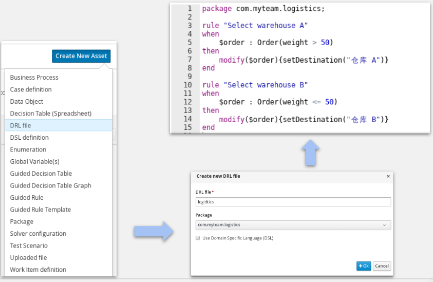
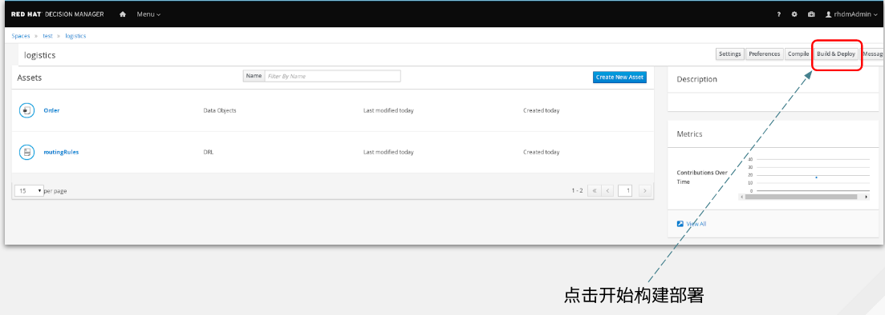
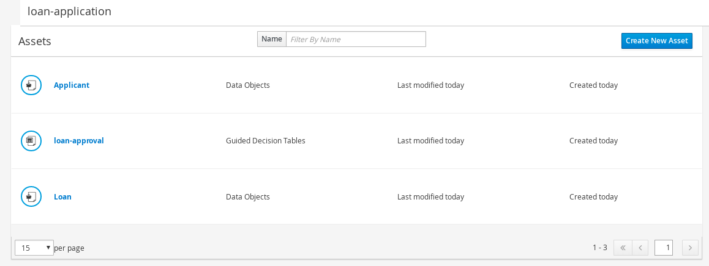
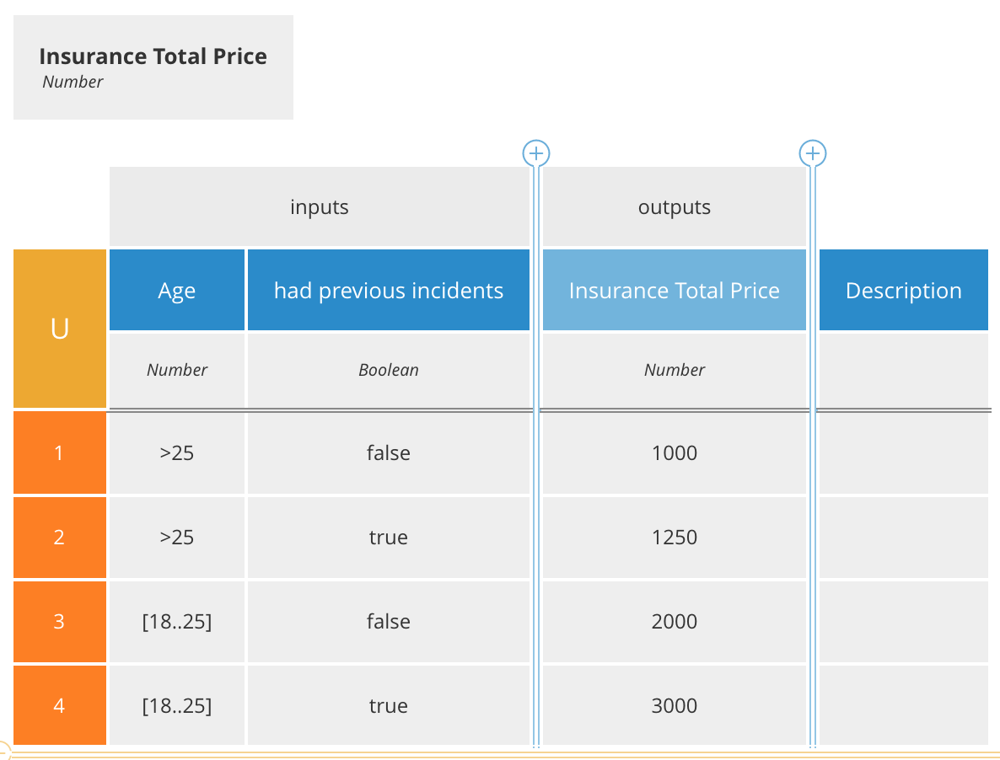

= RHDM 7 安装
:toc: manual

== RHDM 7 安装

=== 准备

[source, java]
.*安装介质*
----
/home/test/upload/
├── apache-maven-3.5.0-bin.zip
├── jboss-eap-7.1.0.zip
├── jdk-8u144-linux-x64.tar.gz
└── rhdm-installer-7.0.0.GA.jar
----

* Java 下载      -  http://www.oracle.com/technetwork/java/javase/downloads/index.html
* Maven 下载     -  http://maven.apache.org/download.cgi
* JBoss EAP 下载 -  https://developers.redhat.com/products/eap/download/
* RHDM 7 下载    -  https://developers.redhat.com/products/red-hat-decision-manager/download/

[source, java]
.*安装介质 - 可选*
----
/home/test/upload/
└── jboss-fuse-karaf-6.3.0.redhat-262.zip
----

=== 安装

[source, java]
----
$ unzip jboss-eap-7.1.0.zip -d ../rhdm/
$ java -jar rhdm-installer-7.0.0.GA.jar
----

NOTE: 如果服务器安装可以使用 console 方式安装：`java -jar rhdm-installer-7.0.0.GA.jar -console`。

NOTE: 安装过程创建的登录用户和密码为 `rhdmAdmin`/`password1!`。

[source, java]
.*创建用户*
----
$ ./bin/add-user.sh -a -u kylin -p password1! -g admin,kie-server,rest-all
----

NOTE: 这个用户用来远程调运 BRM 服务。

[source, xml]
.*配置 standalone/configuration/standalone.xml*
----
<property name="org.kie.example" value="false"/>
<property name="org.kie.server.location" value="http://0.0.0.0:8080/kie-server/services/rest/server"/>
<property name="org.kie.server.controller" value="http://0.0.0.0:8080/decision-central/rest/controller"/>
----

[source, xml]
.*编辑 decision-central.war/WEB-INF/classes/ErraiService.properties，添加*
----
errai.bus.enable_sse_support=false
----

=== 启动

[source, java]
----
./bin/standalone.sh -b 0.0.0.0 -bmanagement=0.0.0.0 2>&1 > ./console-$(date "+%Y%m%d%H%M").log &
----

启动后通过:

* http://127.0.0.1:8080/decision-central/ - 登录 decision-central(设计规则，用户名密码为 `rhdmAdmin`/`password1!`)
* http://127.0.0.1:8080/kie-server/docs/ -  登录规则测试页面(运行规则，用户名密码为 `kylin`/`password1!`)

=== Fuse 安装（可选）

[source, java]
.*安装*
----
$ unzip jboss-fuse-karaf-6.3.0.redhat-187.zip && cd jboss-fuse-6.3.0.redhat-187
----

[source, java]
.*便捷 etc/users.properties, 添加*
----
admin=admin,admin,manager,viewer,Monitor, Operator, Maintainer, Deployer, Auditor, Administrator, SuperUser
----

[source, java]
.*编辑 etc/system.properties, 修改 AMQ 邦定的主机*
----
activemq.host = 0.0.0.0
----

[source, java]
.*启动*
----
./bin/start
----

登录 http://localhost:8181/ ( `admin`/`admin`) 进行简单管理配置与运行时状态查看。

[source, java]
.*启动 http Feature*
----
./bin/client
features:install camel-http
----

== 物流转运示例

物流转运示例规则非常简单，根据 Order 中的重量属性将 Order 投递到不同从仓库

image:img/rhdm-order-rule.png[]

* 当重量超过 50 千克则将 Order 投递到仓库 A
* 当重量没有超过 50 千克则将 Order 投递到仓库 B

=== 1 - 创建一个 Project

在浏览器中输入 http://localhost:8080/decision-central 登录规则管理控制台（使用用户名为 `rhdmAdmin`，密码为`password1!`），在欢迎页面点击 *Design*

image:img/rhdm-design.png[]

在规则设计页面默认 myteam 空间下，点击蓝色按钮 `Add Project`，在弹出的添加 Project 对话框中填写 Project 的名字为 `logistics`

image:img/rhdm-add-project.png[]

继续在添加 Project 对话框中点击蓝色按钮 `Add` 创建一个 Project.

=== 2- 创建 Data Object Order

创建 Order 对象，有如下属性：

1. merchant
2. weight
3. expedited
4. destination

image:img/rhdm-create-data-obj.png[]

=== 3 - 创建规则

创建规则 DRL 文件，添加内容如下：

[source, java]
----
rule "Select warehouse A"
when
    $order : Order(weight > 50)
then
    modify($order){setDestination("仓库 A")}
end

rule "Select warehouse B"
when
    $order : Order(weight <= 50)
then
    modify($order){setDestination("仓库 B")}
end
----

=== 4 - 部署构建

创建默认 KBase 和 KSession 后点击开始构建部署

=== 5 - 运行

部署成功后选择 `Menu` -> `Deploy` -> `Execution Servers`，选择 logistics_1.0.0，查看 KIE Server 状态

image:img/rhdm-kie-status.png[]

点击 Status 链接(http://localhost:8080/kie-server/services/rest/server/containers/logistics_1.0.0)，并在弹出的安全输入框中输入用户名 `rhdmAdmin`，密码 `password1!`，显示 Container logistics_1.0.0 状态如下：

[source, xml]
----
<response type="SUCCESS" msg="Info for container logistics_1.0.0">
  <kie-container container-alias="logistics" container-id="logistics_1.0.0" status="STARTED">
    <messages>
      <content>
      Container logistics_1.0.0 successfully created with module com.myteam:logistics:1.0.0.
      </content>
      <severity>INFO</severity>
      <timestamp>2018-08-01T23:04:06.108+08:00</timestamp>
    </messages>
    <release-id>
      <artifact-id>logistics</artifact-id>
      <group-id>com.myteam</group-id>
      <version>1.0.0</version>
    </release-id>
    <resolved-release-id>
      <artifact-id>logistics</artifact-id>
      <group-id>com.myteam</group-id>
      <version>1.0.0</version>
    </resolved-release-id>
    <scanner status="DISPOSED"/>
  </kie-container>
</response>
----

在浏览器中输入 http://localhost:8080/kie-server/docs/ 进入 Swagger 测试界面，选择 *Rules evaluation :: BRM*，使用 `/server/containers/instances/{id}` 进行测试，输入

[source, json]
.*id*
----
logistics_1.0.0
----

[source, json]
.*body*
----
{
    "lookup":"logistics",
    "commands":[
        {
            "insert":{
                "object":{
                    "com.myteam.logistics.Order":{
                        "weight":68.64,
                        "destination":""
                    }
                },
                "out-identifier":"order"
            }
        },
        {
            "fire-all-rules":{
            }
        }
    ]
}
----

image:img/rhdm-swagger-test.png[]

Swagger 测试返回如下

[source, json]
----
{
  "type": "SUCCESS",
  "msg": "Container logistics_1.0.0 successfully called.",
  "result": {
    "execution-results": {
      "results": [
        {
          "value": {
            "com.myteam.logistics.Order": {
              "merchant": null,
              "weight": 68.64,
              "expedited": null,
              "destination": "仓库 A"
            }
          },
          "key": "order"
        }
      ],
      "facts": [
        {
          "value": {
            "org.drools.core.common.DefaultFactHandle": {
              "external-form": "0:1:1121833382:1121833382:2:DEFAULT:NON_TRAIT:com.myteam.logistics.Order"
            }
          },
          "key": "order"
        }
      ]
    }
  }
}
----

== RHDM 新功能

本部分通过示例验证 RHDM 新功能，包括如下示例：

|===
|名称 |说明

|<<贷款审批, 贷款审批>>
|规则表格语法

|<<保险定价, 保险定价>>
|DMN 标准定义规则

|<<流程驱动贷款审批, 流程驱动贷款审批>>
|流程驱动规则
|===

=== 贷款审批

本示例说明 RHDM 7 规则表格语法。

在 Decision Central 中导入 
    https://github.com/jbossdemocentral/rhdm7-loan-demo-repo.git
Loan Demo 只包括两个数据模型(Loan & Applicant) 和一个 decision table (loan-application)：

image:img/dm-loan-demo-decision.png[dm-loan-demo-decision]

点击 `Build & deploy` 按钮进行构建示例工程，`Menu` -> `Deploy` -> `Execution Servers` *loan-application_1.0.0* 已经部署到 Decision Server。点击 http://localhost:8080/kie-server/docs/ 进入 DM Swagger UI 界面，通过 API 描述可以进行集成或测试。

使用 /server/containers/instances/{id} POST API 进行 Fire Rules 测试:

[source, json]
.*POST 请求参数示例*
----
{
    "lookup":"default-stateless-ksession",
    "commands":[
        {
            "insert":{
                "object":{
                    "com.redhat.demos.dm.loan.model.Applicant":{
                        "creditScore":230,
                        "name":"Fire Tester"
                    }
                },
                "out-identifier":"applicant"
            }
        },
        {
            "insert":{
                "object":{
                    "com.redhat.demos.dm.loan.model.Loan":{
                        "amount":2500,
                        "approved":false,
                        "duration":24,
                        "interestRate":1.5
                    }
                },
                "out-identifier":"loan"
            }
        },
        {
            "fire-all-rules":{
            }
        }
    ]
}
----

[source, json]
.*请求执行返回示例*
----
{
  "type": "SUCCESS",
  "msg": "Container loan-application_1.0.0 successfully called.",
  "result": {
    "execution-results": {
      "results": [
        {
          "value": {
            "com.redhat.demos.dm.loan.model.Loan": {
              "amount": 2500,
              "duration": 24,
              "interestRate": 1.5,
              "approved": true
            }
          },
          "key": "loan"
        },
        {
          "value": {
            "com.redhat.demos.dm.loan.model.Applicant": {
              "name": "Fire Tester",
              "creditScore": 230
            }
          },
          "key": "applicant"
        }
      ],
      "facts": [
        {
          "value": {
            "org.drools.core.common.DefaultFactHandle": {
              "external-form": "0:2:1013116106:1013116106:2:DEFAULT:NON_TRAIT:com.redhat.demos.dm.loan.model.Loan"
            }
          },
          "key": "loan"
        },
        {
          "value": {
            "org.drools.core.common.DefaultFactHandle": {
              "external-form": "0:1:197872233:197872233:1:DEFAULT:NON_TRAIT:com.redhat.demos.dm.loan.model.Applicant"
            }
          },
          "key": "applicant"
        }
      ]
    }
  }
}
----

基于以上示例进行如下几次测试:

|===
|申请人的信用度 Credit |申请人申请借贷的总数 Amount |审核结果 Approved 

|200
|100
|false

|300
|3000
|true

|300
|4500
|false

|500
|4500
|true
|===

=== 保险定价

本示例说明通过 RHDM 7 DMN 标准定义规则。

在 Decision Central 中导入
    https://github.com/jbossdemocentral/rhdm7-insurance-pricing-dmn-demo-repo.git 
保险定价使用如下逻辑

点击 `Build & deploy` 按钮进行构建示例工程，`Menu` -> `Deploy` -> `Execution Servers` *insurance-pricing-dmn_1.0.0* 已经部署到 Decision Server。点击 http://localhost:8080/kie-server/docs/ 进入 DM Swagger UI 界面，通>过 API 描述可以进行集成或测试。

使用 /server/containers/instances/{id}/dmn POST API 进行 Fire Rules 测试:

[source, json]
.*POST 请求参数示例*
----
{
    "model-namespace":"http://www.trisotech.com/definitions/_bb8b9304-b29f-462e-9f88-03d0d868aec5",
    "model-name":"Insurance Pricing",
    "decision-name":null,
    "decision-id":null,
    "dmn-context":{
       "had previous incidents":false,
       "Age":23
    }
}
----

[source, json]
.*请求执行返回示例*
----
{
  "type": "SUCCESS",
  "msg": "OK from container 'insurance-pricing-dmn_1.0.0'",
  "result": {
    "dmn-evaluation-result": {
      "messages": [],
      "model-namespace": "http://www.trisotech.com/definitions/_bb8b9304-b29f-462e-9f88-03d0d868aec5",
      "model-name": "Insurance Pricing",
      "decision-name": null,
      "dmn-context": {
        "had previous incidents": false,
        "Age": 23,
        "Insurance Total Price": 2000
      },
      "decision-results": {
        "_7c68efef-3b20-4807-8d15-7f55995cc8fd": {
          "messages": [],
          "decision-id": "_7c68efef-3b20-4807-8d15-7f55995cc8fd",
          "decision-name": "Insurance Total Price",
          "result": 2000,
          "status": "SUCCEEDED"
        }
      }
    }
  }
}
----

基于以上示例进行如下几次测试:

|===
|had previous incidents |Age |Insurance Total Price

|false
|23
|2000

|true
|23
|3000

|false
|30
|1000

|true
|30
|1250

|===

=== 流程驱动贷款审批

本示例演示流程驱动贷款审批。

在 Decision Central 中导入
  https://github.com/jbossdemocentral/rhdm7-qlb-loan-demo-repo.git
计算审批流程如下

image:img/dm-loan-process.png[dm-loan-process.png]

点击 `Build & deploy` 按钮进行构建示例工程，`Menu` -> `Deploy` -> `Execution Servers` *loan-application_1.0* 已经部署到 Decision Server。点击 http://localhost:8080/kie-server/docs/ 进入 DM Swagger UI 界面
，通>过 API 描述可以进行集成或测试。

使用 /server/containers/instances/{id} POST API 进行 Fire Rules 测试:

[source, json]
.*POST 请求参数示例*
----
{
  "lookup": "default-stateless-ksession",
  "commands": [
    {
      "insert": {
        "object": {
          "com.redhat.demo.qlb.loan_application.model.Applicant": {
            "creditScore":410,
            "name":"Lucien Bramard",
            "age":40,
            "yearlyIncome":90000
          }
        },
        "out-identifier":"applicant"
      }
    },
    {
      "insert": {
        "object": {
          "com.redhat.demo.qlb.loan_application.model.Loan": {
            "amount":250000,
            "duration":10
          }
        },
        "out-identifier":"loan"
      }
    },
    {
      "start-process" : {
        "processId" : "loan-application.loan-application-decision-flow",
        "parameter" : [ ],
        "out-identifier" : null
      }
    }
  ]
}
----

[source, json]
.*返回结果示例*
----
{
  "type": "SUCCESS",
  "msg": "Container loan-application_1.0 successfully called.",
  "result": {
    "execution-results": {
      "results": [
        {
          "value": {
            "com.redhat.demo.qlb.loan_application.model.Loan": {
              "amount": 250000,
              "duration": 10,
              "interestRate": 0.72,
              "approved": true,
              "comment": "sufficient credit score",
              "monthlyRepayment": 2098.3333333333335
            }
          },
          "key": "loan"
        },
        {
          "value": {
            "com.redhat.demo.qlb.loan_application.model.Applicant": {
              "name": "Lucien Bramard",
              "creditScore": 410,
              "age": 40,
              "eligible": true,
              "yearlyIncome": 90000,
              "monthlyIncome": 7500
            }
          },
          "key": "applicant"
        }
      ],
      "facts": [
        {
          "value": {
            "org.drools.core.common.DefaultFactHandle": {
              "external-form": "0:2:1748584180:1748584180:2:DEFAULT:NON_TRAIT:com.redhat.demo.qlb.loan_application.model.Loan"
            }
          },
          "key": "loan"
        },
        {
          "value": {
            "org.drools.core.common.DefaultFactHandle": {
              "external-form": "0:1:1107194867:1107194867:1:DEFAULT:NON_TRAIT:com.redhat.demo.qlb.loan_application.model.Applicant"
            }
          },
          "key": "applicant"
        }
      ]
    }
  }
}
----
