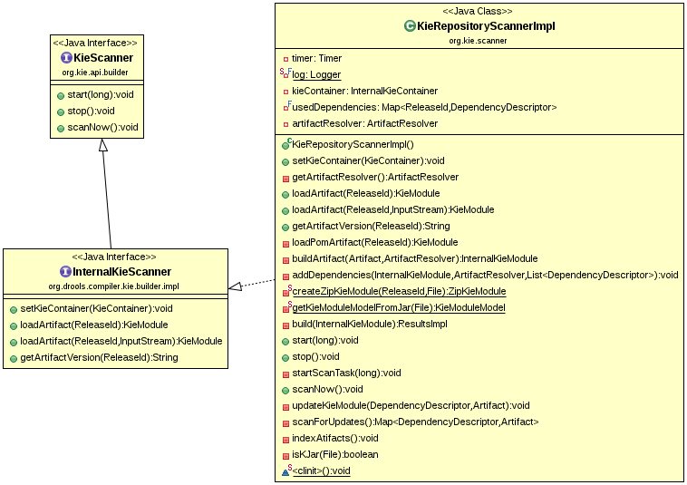

* KieRepository 是一个单例的实体，它的角色是一个仓库，这个仓库中保存着所有的 KieModule，通常 KieModule 从远程的 Maven仓库中获取，KieRepository 也提供了相关的接口，用于通过API添加或删除KieModule。相关的类实现如下：

* KieScanner 是一个扫描器，它能够扫描 maven 仓库，它用来自动发现一个新的 KieModule 的发布，如果 KieModule 有新版本发布，KieScanner会扫描发现它，并自动更新 KieRepository，使其与 maven 仓库保持一致。start(long pollingInterval)方法开始扫描，且每次扫描的时间间隔为pollingInterval；stop()方法是停止扫描；scanNow()开始同步扫描。相关的类实现如下：

