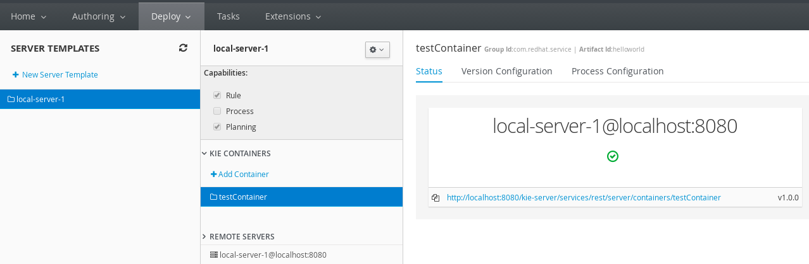

= Firing rules using kie server Java Client API
:toc: manual
:toc-placement: preamble

.

== 配置 KIE 服务器

 KIE 服务器可以以集群的方式，分布式的状态运行，本处演示基于本地和规则仓库一起运行。

[source, shell]
.*配置用户名/密码*
----
./add-user.sh -a --user kieserver --password password1! --role kie-server,rest-all
----

[source, shell]
.*添加初始化参数*
----
/system-property=org.kie.server.user:add(value=kieserver)
/system-property=org.kie.server.pwd:add(value=password1!)
/system-property=org.kie.server.location:add(value=http://localhost:8080/kie-server/services/rest/server)
/system-property=org.kie.server.controller:add(value=http://localhost:8080/business-central/rest/controller)
/system-property=org.kie.server.controller.user:add(value=kieserver)
/system-property=org.kie.server.controller.pwd:add(value=password1!)
/system-property=org.kie.server.id:add(value=local-server-1)
----

NOTE: 如上命令关联的用户名/密码在之前的命令中创建。

*在管理控制台创建一个运行容器，关联规则仓库中的规则*

NOTE: 如上所示，创建的 KIE 服务 ID 为 local-server-1，关联的运行时容器为 testContainer, 状态为启动状态

== 远程调运 KIE 服务器

[source, java]
----
Person p1 = new Person();
p1.setFirstName("Anton");
p1.setLastName("RedHat");
p1.setHourlyRate(11);
p1.setWage(20);

        
String url = "http://localhost:8080/kie-server/services/rest/server";
String username = "kieserver";
String password = "password1!";
String container = "testContainer";
String session = "testSession";
        
KieServicesConfiguration config = KieServicesFactory.newRestConfiguration(url, username, password);
Set<Class<?>> allClasses = new HashSet<Class<?>>();
allClasses.add(Person.class);
config.addExtraClasses(allClasses);
        
KieServicesClient client  = KieServicesFactory.newKieServicesClient(config);
RuleServicesClient ruleClient = client.getServicesClient(RuleServicesClient.class);
List<GenericCommand<?>> commands = new ArrayList<GenericCommand<?>>();
        
commands.add((GenericCommand<?>) KieServices.Factory.get().getCommands().newInsert(p1,"Person Insert ID"));
commands.add((GenericCommand<?>) KieServices.Factory.get().getCommands().newFireAllRules("fire-identifier"));
        
BatchExecutionCommand batchCommand = KieServices.Factory.get().getCommands().newBatchExecution(commands,session);
ServiceResponse<ExecutionResults> response = ruleClient.executeCommandsWithResults(container, batchCommand);
System.out.println(response.getResult().getValue("fire-identifier"));
----

完整代码参照 link:src/main/java/org/drools/examples/Example_FireRule_KieServer.java[Example_FireRule_KieServer.java]

如上代码运行，KIE 服务器在 console 口输出的日志为

[source, java]
----
16:21:09,221 INFO  [stdout] (http-/127.0.0.1:8080-6) Hello Anton RedHat!
16:21:09,221 INFO  [stdout] (http-/127.0.0.1:8080-6) You are rich!
----

