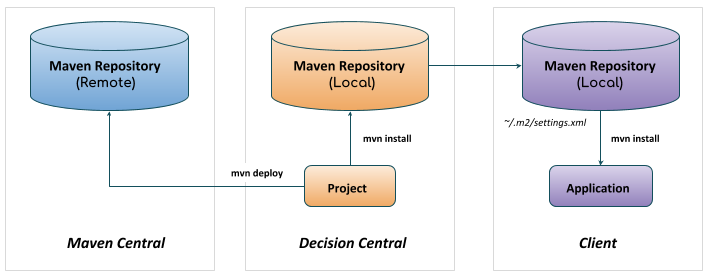

= Maven 配置设置
:toc: manual

== 架构说明

从 drools 6 开始，规则的发布使用基于 Maven 的架构，Drools Decision Central 会提供一个 Maven 仓库，保存着所有发布版本的规则（以 kjar）的形式保存，Decision Central 也可以将规则发布到远程 Maven 仓库，例如企业内部的仓库；客户端应用如果想加载规则，则只需要配置 Maven setting.xml 后在自己的工程中添加一个依赖。

== setting.xml 配置

=== 添加 profile

[source,xml]
----
<profile>
    <id>guvnor-m2-repo</id>
    <repositories>
        <repository>
          <id>guvnor-m2-repo</id>
          <name>BRMS Repository</name>
          <url>http://localhost:8080/decision-central/maven2/</url>
          <layout>default</layout>
          <releases>
            <enabled>true</enabled>
            <updatePolicy>always</updatePolicy>
          </releases>
          <snapshots>
            <enabled>true</enabled>
            <updatePolicy>always</updatePolicy>
          </snapshots>
        </repository>
    </repositories>
</profile>
----

NOTE: The `updatePolicy` can be always", "daily" (default), "interval:XXX" (in minutes) or "never" (only if it doesn't exist locally).

=== 配置 server

It is either needed to turn on pre-emptive authentication for the repository server by

[source,xml]
----
<server>
    <id>guvnor-m2-repo</id>
    <username>kylin</username>
    <password>password1!</password>
    <configuration>
      <wagonProvider>httpclient</wagonProvider>
      <httpConfiguration>
        <all>
          <usePreemptive>true</usePreemptive>
        </all>
      </httpConfiguration>
    </configuration>
</server>
----

or set Authorization HTTP header with Base64 encoded credentials

[source,xml]
----
<server>
    <id>guvnor-m2-repo</id>
    <configuration>
      <httpHeaders>
        <property>
          <name>Authorization</name>
          <!-- Base64-encoded "kylin:password1!" -->
          <value>Basic a3lsaW46cGFzc3dvcmQxIQ==</value>
        </property>
      </httpHeaders>
    </configuration>
</server>
----

=== 本地加载规则

在本地工程中添加依赖配置：

[source, xml]
----
<dependency>
    <groupId>com.sample</groupId>
    <artifactId>helloworld</artifactId>
    <version>1.0.0</version>
</dependency>
----

