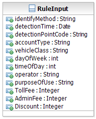
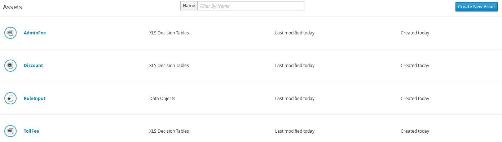

= 智能交通
:toc: manual

== 业务简介

智能交通系统中的道路收费系统的基本业务场景是：载有特定装置（通常是电子标签装置或者是有全球卫星定位功能的装置）的车辆进入收费区后，收费区的信号探测器发出扫描信号，检测并获取该车的有关信息，譬如信号探测系统能够获取并记录诸如车辆的几何尺寸、车重、车型等数据。对于没有安装这种装置的车辆来说，系统可以通过摄像机拍摄记录获得车型、车牌号等信息。然后根据不同的收费业务规则，针对不同的车辆采取不同的收费标准。

image:src/img/intelligent-transportation.png []

目前主要的道路收费业务规则有基于特殊道路使用收费、基于区域收费和基于距离 / 时间收费等。

* 基于特殊道路使用收费：这种收费模式通常是针对特殊的道路，如某条高速公路。这种收费的业务规则比较简单，当车辆通过一次收费检测点就收取一次费用。基于特殊道路的使用收费模式还广泛应用在城市拥堵费收取中。当车辆通过某条比较拥堵的公路时，就会被收取相应的费用。
* 基于区域收费：这种收费模式是指在某个指定的区域内对行驶车辆收取一定的费用。需要记录车辆何时何地进入指定区域以及何时何地离开，当获得完整的车辆进入和离开的信息以后，将会产生一次计费。
* 基于距离 / 时间收费：这种收费模式通常应用在整个国家的公路网，可以覆盖所有的车辆类型，收费的业务规则是以车辆行驶的距离（时间）为输入。首先在车辆上安装一个特殊的车载器件（目前运用很多的是有全球卫星定位功能的仪器），当装有 GPS 仪器的车辆在开上高速公路后，收费系统借助于卫星信号和其他定位传感器，得到车辆的位置，通过卫星定位系统确定车辆在高速公路上行驶的里程，然后进行结算，自动统计缴费额，并把数据按一定间隔时间发送到道路收费中心，由收费中心向拥有车辆的运输公司开出账单，收取这段里程的道路使用费用。

== 业务规则决策管理系统

前面提到的智能交通系统中的业务规则，是业务场景中真实存在的，为了实现这些业务规则，我们可以通过在程序代码里，用各种编程语言和其他业务逻辑同样的实现。但是由于业务规则的易变性，很容易导致程序代码的重写，无疑会增加维护的成本和无法快速反应需求的变化。业务规则引擎提供了对业务规则解析执行。降低实现业务逻辑的复杂性，提高了应用程序的可维护性和可扩展性。业务规则决策管理系统是在业务规则引擎基础上的扩展，提供了一套包含业务规则整个生命周期的管理系统。减轻了业务规则维护的工作量。降低了复杂性，方便用户而不是技术专家来管理业务规则。提供了业务规则动态修改的能力，即业务人员通过在系统中改变业务规则文件，应用程序无需重新装载，就能及时反应规则的变化。

== 详细业务规则抽取

这里以一个高速公路收费的场景为例，抽取其中详细的计费业务规则。此业务规则是前面介绍过的基于特殊道路使用的收费模式的一种应用，当车辆通过一次收费检测点就收取一次费用，产生一条收费账单。对于不同的车辆，通过不同的道路，将会被收取不同的费用。

=== 业务规则输入

不同的道路类型、收费检测点类型、车辆类型、账户类型、车辆使用类别和不同的通行时间会产生不同的费用。这些信息都将作为计费业务规则的输入。

* 道路运营商代码
* 收费检测点代码
* 车辆通过收费检测点时间
* 车辆类型 ( 摩托车、小型轿车、卡车等 )
* 车辆用途类别
* 车辆识别方法 ( 通过电子标签识别、通过车牌摄像识别等 )
* 车辆绑定账户类别

=== 业务规则输出

* 收费项目列表 ( 如道路基本使用费、附加费和折扣等 )
* 收费项目明细 ( 包括收费类别以及费用金额 )

=== 业务规则抽取结果

*道路使用费的业务规则*

如果车辆安装合法的电子标签设备，当车辆通过收费站时，系统将通过读取电子标签的内容识别车辆信息。如果车辆未安装合法的电子标签设备，系统会启动摄像头拍摄车辆通过时的图片，自动识别图片中的车牌信息。如果系统无法自动识别，将通过人工识别获得车辆信息。无论是通过电子标签识别，自动车牌识别，还是人工识别，当获得车辆本身信息以及车辆绑定的账户信息之后，可以根据相应的业务规则计算出道路使用费用。

一个简单的道路使用计费规则如下表所示：

|===
|道路运营商代码 |收费检测点代码 |车辆绑定账户类别 |车辆类型 |日期 |时间 |车辆用途类别 |道路基本使用费 

|1 
|201
|001
|ANNUAL
|2018-08-08
|17:24
|A
|5.1

|2 
|201
|001
|ANNUAL
|2018-08-08
|8:08
|A
|4.9

|3 
|201
|001
|ANNUAL
|2018-08-08
|17:24
|A
|5

|4 
|201
|001
|ANNUAL
|2018-08-08
|8:08
|A
|3.3

|5 
|201
|001
|ANNUAL
|2018-08-08
|17:24
|B
|6.5

|6 
|201
|001
|ANNUAL
|2018-08-08
|8:08
|B
|5.3

|7 
|201
|001
|ANNUAL
|2018-08-08
|17:24
|B
|5.4

|8 
|201
|001
|ANNUAL	
|2018-08-08
|8:08
|B
|3.7

|9 
|201
|001
|TEMP
|2018-08-08
|17:24
|C
|5.2

|10 	
|201
|001
|TEMP
|2018-08-08
|8:08
|C
|3.4
|===

*附加费用的业务规则*

在前面我们提到，系统可能会通过不同的方法识别车辆：电子标签识别（TAG），自动识别车牌（OCR）或人工识别车牌 (MIR)，不同的识别方法可能产生不同的附加费用。电子标签识别快速、简单，这里附加费用为 0。自动车牌识别将启用光学图片识别引擎来识别车牌，产生一定的附加费（0.5 元）。而人工识别则是在自动车牌识别失败后，通过人眼辨别图像识别车辆，需要耗费更多的系统资源和人力，产生了较高的附加费用（1 元）。附加费用的收取可以鼓励车主使用电子标签，使得收费更快捷简单。

|===
|序号 |车辆识别方法 |附加费

|1 
|TAG 
|0 

|2 
|OCR 
|0.5 

|3 
|MIR 
|1 
|===

*折扣的业务规则*

用户在为车辆注册绑定账户时，可以选择不同的账户类型，如临时账户 (TEMP)、年结算账户（ANNUAL），不同的账户类型可以给予不同的优惠。

|===
|序号 |车辆绑定账户类别 |折扣 

|1 
|ANNUAL 
|-0.2 

|2 
|TEMP 
|-0.4 
|===

== 规则应用开发

=== 业务对象建模

BOM(Business Object Model) 是业务规则引擎所要操作的对象。在 Drools 中业务对象就是普通的 Java 对象。我们建立一个叫做 RuleInput 的对象如下图所示，这是一个保存输入输出参数的对象。包含 identifyMethod，detectionTime，detectionPointCode，accountType，vehicleClass，dayOfWeek，timeOfDay，operator，purposeOfUse，这些都是作为判断条件的参数，而 TollFee，AdminFee 和 Discount 对应三种计算所得的子项，存放通行费，附加费和折扣值。

[source, java]
----
public class RuleInput implements Serializable {

    private static final long serialVersionUID = -8286627753131708167L;
    
    private String identifyMethod;
    
    private Date detectionTime;
    
    private String detectionPointCode;
    
    private String accountType;
    
    private String vehicleClass;
    
    private int dayOfWeek;
    
    private int timeOfDay;
    
    private String operator;
    
    private String purposeOfUse;
    
    private Integer TollFee;
    
    private Integer AdminFee;
    
    private Integer Discount;
----

=== 基于决策表的规则文件

这一步我们就要进入关键的一步了——创建和编辑规则文件。Drools 支持多种业务规则的定义方式，如基于业务规则语言 drl（Drools Rule Language）的方式，基于自然语言的方式和基于决策表的方式等。决策表是一种简单但是精确的表示规则的方式，容易使业务人员理解和使用。所以我们采用基于决策表来定义我们的业务规则。决策表可以用 MS office 或 OpenOffice 编辑。其中的一行就是一条规则，分为条件和动作两部分，如果满足条件则执行相应的动作。

决策表包括以下几部分：

* *规则集合的定义* - 一个文件对应一个规则集合，可以包含多个规则表。第二行关键字 RuleSet，其值和工作目录名一致。Import 关键字定义规则引擎装载业务对象的类路径。Notes 关键字是用来注释这个规则集合的用途。

* *规则表的定义* - 每个规则表，分为表格头和表格体两部分。表头定义表格的模板信息。第六行 RuleTable 关键字表示一个规则表从这里开始。第七行说明所在列是条件还是动作。第八行表示规则所要操作的对象模型，我们声明了一个 fee 变量，它的类型是前面定义的 RuleInput 类。在动作那一列我们就可以使用 fee 这个变量了。第九行就是条件模板或者动作模板，定义了输入业务模型实例的属性满足条件模板就执行动作模板，例如输入的 RuleInput 实例如果 operator==201，则满足了表格体的第一行第一列条件。同样，如果车辆被探测到的时间在 8 点到 24 点之间，那么满足了表格体的第一行第六列条件。其中 $1 表示第一个参数，$2 表示第二个参数，当只有一个参数时，就用 $param 来表示。第十行是对各个属性的描述。

*基于决策表的规则文件——计算通行费* - link:src/main/resources/com/sample/rules/TollFee.xls[TollFee.xls] 表内容如下：

image:src/img/tollfee-table.png[]

*基于决策表的规则文件——计算附加费* - link:src/main/resources/com/sample/rules/AdminFee.xls[AdminFee.xls]

image:src/img/adminfee-table.png[]

*基于决策表的规则文件——折扣* - link:src/main/resources/com/sample/rules/Discount.xls[Discount.xls]

image:src/img/discount-table.png[]

== 规则运行

=== 本地嵌入式运行

运行 link:src/main/java/com/sample/Main.java[Main] 可以通过 Kie API 本地执行规则表格，此方法模拟了 10 个业务场景，计算结果如下:

[source, java]
----
TEST START ...
TEST 01: TollFee = 510, AdminFee = 50, Total = 510
TEST 02: TollFee = 490, AdminFee = 50, Total = 490
TEST 03: TollFee = 500, AdminFee = 50, Total = 500
TEST 04: TollFee = 330, AdminFee = 0, Total = 330
TEST 05: TollFee = 650, AdminFee = 0, Total = 650
TEST 06: TollFee = 530, AdminFee = 0, Total = 530
TEST 07: TollFee = 540, AdminFee = 0, Total = 540
TEST 08: TollFee = 370, AdminFee = 100, Total = 370
TEST 09: TollFee = 520, AdminFee = 100, Total = 520
TEST 10: TollFee = 480, AdminFee = 100, Total = 480
TEST SUCCESS
----

=== 本地 RHDM 服务器上运行

参照 link:../docs/rhdm.adoc#_rhdm_7[RHDM 7 安装] 部分内容安装启动 RHDM 7，启动完成后登录 decision-central。

上传业务对象模型，选择业务模型 RuleInput.java

image:src/img/intelligent-transportation-models.png[]

继续选择上传文件，上传三个规则表格

image:src/img/intelligent-transportation-xls.png[]

上传完成，decision-central Assets 如下如所示：

创建 KBase 和 KSession 后，点击 `Build & Deploy`，构建和部署完成后参照 参照 link:../docs/rhdm.adoc#_5[物流转运示例运行部分]，进行测试。

*Rest 请求* - 如下图所示发送 REST 请求：

image:src/img/rest-request.png[]

[source, json]
.*id*
----
sample_1.0.0
----

[source, json]
.*body*
----
{
    "lookup":"transportation-ksession",
    "commands":[
        {
            "insert":{
                "object":{
                    "com.sample.models.RuleInput":{
                        "identifyMethod":"TAG",
                        "operator":"201",
                        "detectionPointCode":"001",
                        "accountType":"ANNUAL",
                        "vehicleClass":"1",
                        "dayOfWeek":5,
                        "timeOfDay":18,
                        "purposeOfUse":"A"
                    }
                },
                "out-identifier":"results"
            }
        },
        {
            "fire-all-rules":{
            }
        }
    ]
}
----

[source, json]
.*Rest 执行返回如下图所示*
----
"results": [
        {
          "value": {
            "com.sample.models.RuleInput": {
              "identifyMethod": "TAG",
              "detectionTime": null,
              "detectionPointCode": "001",
              "accountType": "ANNUAL",
              "vehicleClass": "1",
              "dayOfWeek": 5,
              "timeOfDay": 18,
              "operator": "201",
              "purposeOfUse": "A",
              "tollFee": 510,
              "adminFee": 50,
              "discount": -20
            }
          },
          "key": "results"
        }
      ]
----

=== OpenShift 容器云上运行

如下两个镜像是 OpenShift 容器云上运行所需要的镜像：

* registry.access.redhat.com/rhdm-7/rhdm70-decisioncentral-openshift
* registry.access.redhat.com/rhdm-7/rhdm70-kieserver-openshift

启动后使用如上类似的步骤运行。
