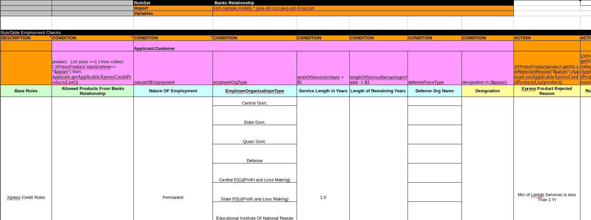
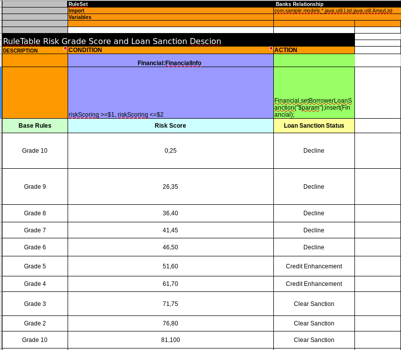
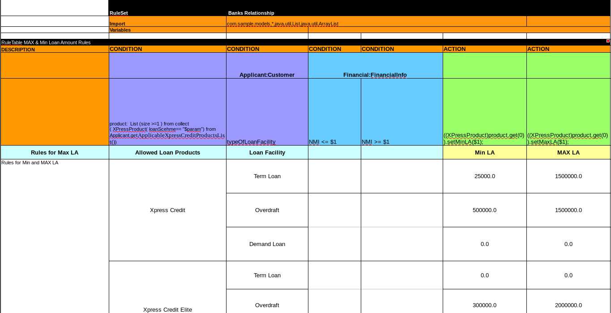
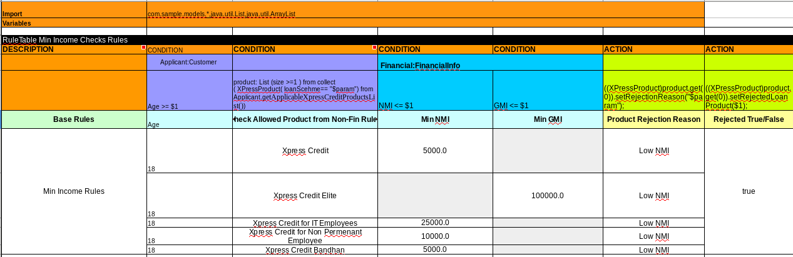

= 贷款审批
:toc: manual

== 背景说明

某银行的 X 信用计划项目主要是以预先核准贷款的形式，面向主要事业单位，中央和省政府机构，半政府，国家教育机构和良好声誉公司（取得合格评级）的员工制定的。 后来，该计划扩大到包括一些信息技术部门的工作人员，非政府机构其它人员，如私立学校的教学和非教学人员以及非长期雇员。为了维持和延续个人贷款业务的持续增长轨迹，某银行推出 X 信用计划项目，以针对已知账户的现有客户和未在该银行设立账户的新客户。

项目名称为个人贷款(Personal Loan)，贷款计划名为 X 贷款，项目中包括以下几点

1. X 贷款
2. X 贷款评审
3. 为信息技术员工提供 X 信贷
4. 为非固定合同雇用的员工提供 X 信贷
5. 为特定地区的人员提供 X 信贷

批准的贷款将用于贷款人合法个人开支，但它不能用于任何投机目的。申请人声明将足以确保贷款目的。贷款可能情况如下：

1. 国内或国外旅行
2. 医疗治疗
3. 女儿/儿子的婚姻
4. 养老保险
5. 购置资产
6. 任何其他非投机性开支

== 规则设计

=== 申请人和银行的关系判断

X 贷款主要面向主要是在 X 银行有工资卡账户的申请入，但一些其它贷款允许其它人申请，本规则需要关联申请人和贷款产品。

*申请人和银行的关系判断规则表格* - link:src/main/resources/com/sample/Relationship_With_Bank.xls[Relationship_With_Bank.xls]

image:src/img/loan-bank-relationship.png[]

=== 公司员工资格评审

X 贷款公司员工资格评审，上面规则表格执行会触发此评审。

*公司员工资格评审规则表格* - link:src/main/resources/com/sample/EmploymentCheckForXpressProducts.xlsx[EmploymentCheckForXpressProducts.xlsx]

=== 风险评分和借贷限制

X 贷款会根据风险评分对借贷进行限制。

*风险评分和借贷限制规则表格* - link:src/main/resources/com/sample/RiskScoreCard_Loan_Descion_Rules.xlsx[RiskScoreCard_Loan_Descion_Rules.xlsx]

=== 最大和最小贷款

X 产品会根据申请者的信息计算最大和最小贷款额。

*最大和最小贷款规则表格* - link:src/main/resources/com/sample/Min_Max_LoanAmount_Cap_Rules.xlsx[Min_Max_LoanAmount_Cap_Rules.xlsx]

=== 贷款额度计算

X 银行会根据不同贷款种类进行贷款额度的计算。

*贷款额度计算规则表格* - link:src/main/resources/com/sample/Calculate_Eligible_Loan_Amount.xlsx[Calculate_Eligible_Loan_Amount.xlsx]

image:src/img/loan-amount.png[]

=== CIR 风险评估

CIR 风险评估是通用方式， X 银行贷款也是基于此进行风险评估。

*CIR 风险评估规则表格* - link:src/main/resources/com/sample/CIR_Rules.xlsx[CIR_Rules.xlsx]

image:src/img/loan-cir.png[]

=== 最小收入计算

X 银行的贷款需要计算申请者的最小收入。

*最小收入计算规则表格* - link:src/main/resources/com/sample/Minimum_Income_Rules.xlsx[Minimum_Income_Rules.xlsx]

== 规则运行

[source, java]
.*Java 本地测试规则*
----
KieSession ksession = newSession();

FinancialInfo f = new FinancialInfo();
f.setIsXBSalaryAccount("false");
f.setRGScore(4);
f.setNoOfXpressCreditTopups(0);

Customer c = new Customer();
c.setAge(24);

ksession.insert(f);
ksession.insert(c);
ksession.fireAllRules();

ksession.dispose();
----

