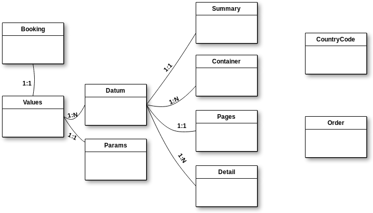
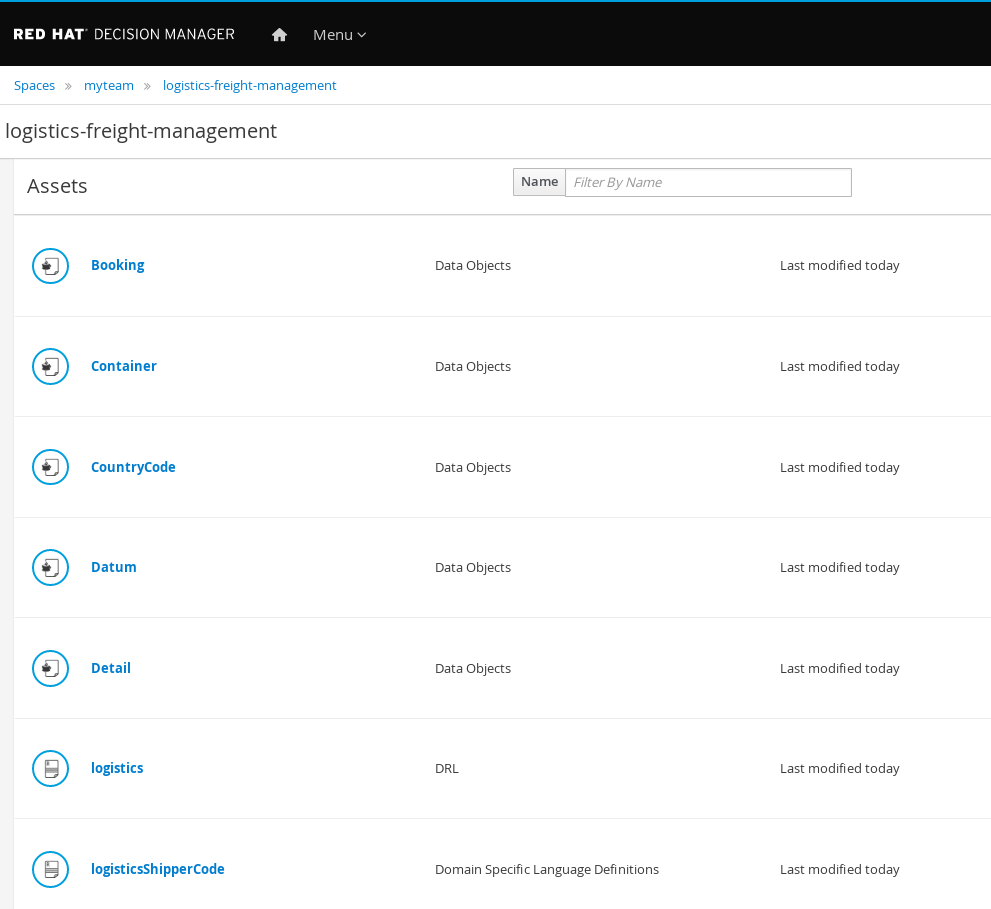
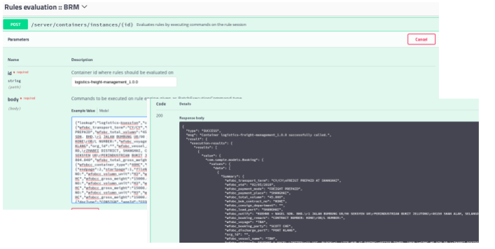
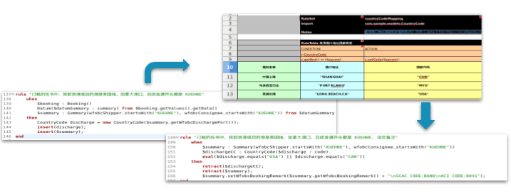
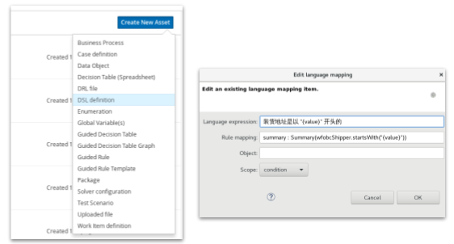
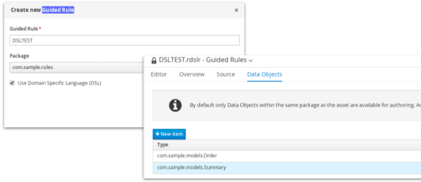
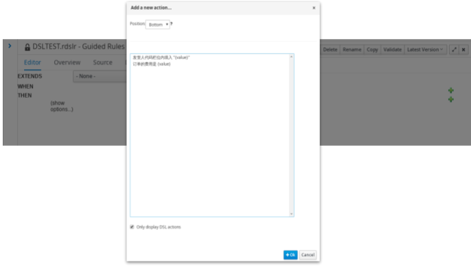

= 物流运单管理
:toc: manual

== 需求分析

某跨国物流公司 IT 信息事业部需要处理订单的信息，订单（一个订单处理业务）模型结构如下

对订单处理的规则如下：

. 接收地址和发送地址每行不能超过 35 个字符，超过则自动换行，注意：不能将一个单词分裂为两行
. 所有发送地址开头是“KUEHNE”的，在发货人代码栏位内填入：N:SMTC
. 所有发送地址开头不是“KUEHNE”的，在发货人代码栏位内填入：B
. 当订单的付款方式是“FREIGT COLLECT”，将`交货地`内容复制后填写在客户端`付款地点`栏位，并在`运费条款说明`里输入“FREIGT COLLECT AT 交货地的值”
. 当订单的付款方式是“FREIGT PREPAID”，将`装货地`内容复制后填写在`付款地点`栏位，并在`运费条款说明`里输入“FREIGT PREPAID AT 装货港的值”。
. 如果目的地是美国或加拿大的，HS CODE必须是8位数字。若订单中的 HS CODE 超过8位，请自动截取前8位填写到指定栏位，若不满8未，则末尾自动以“0”补齐后填写到指定栏位
. 如果目的地不是美国或加拿大的，HS CODE必须是6位数字。若订单中的 HS CODE超过6位，请自动截取前6位填写到指定栏位，若不满6未，则末尾自动以“0”补齐后填写到指定栏位
. 所有订单的包装单位都取单数，例如订单上显示PACKAGES，则修改为PACKAGE
. 如果订单中，其目的地是美国、加拿大，且发送和接收地址开头都是“KUEHNE”，则在备注里中添加：SCAC CODE， ACI CODE。注意：以上内容分两行显示在备注中，也不要连接在其他备注内容后
. 如果订单中，其目的地是美国、加拿大，且发送和接收地址开头都不是“KUEHNE”，则在备注里中添加：CARRIER FILLING。注意：以上内容不要和其他备注内容连接在一起，另起一行显示

== 架构图

image:src/img/architecture.png[]

如上架构图中包括两部分：

* 左边是 JBoss Fuse(Camel) 提供的轻量级敏捷集成平台，通过 Queue 提供接口，Queue 接收新订单，Fuse 从 Queue 取出订单并调运 BRM 服务并将返回发送给 Queue;
* 右边是 RHDM(Drools) 提供规则设计、运行、保存的平台。

== 运行

=== 导入 Fact 和 Rules 到 RHDM

登录 RHDM 控制台(http://localhost:8080/decision-central)，创建 Space `sample`，创建 Project  `logistics-freight-management`。

[source, bash]
.*克隆新创建的项目*
----
$ git clone ~/work/rhdm/jboss-eap-7.1/.niogit/sample-myrepo.git/ && cd sample-myrepo/logistics-freight-management
----

[source, xml]
.*编辑 pom.xml，添加依赖*
----
<dependency>
      <groupId>com.fasterxml.jackson.core</groupId>
      <artifactId>jackson-annotations</artifactId>
      <version>2.8.9</version>
</dependency>
----

[source, bash]
.*拷贝规则*
----
$ rm -fr src/main/resources/
$ cp -r ~/logistics-freight-management/src/main/resources/ src/main/
----

[source, bash]
.*拷贝 Fact*
----
$ mkdir -p src/main/java/com/sample/models
$ cp ~/src/drools-examples/logistics-freight-management/src/main/java/com/sample/models/*.java src/main/java/com/sample/models/
$ mkdir -p src/main/java/com/sample/utils
$ cp ~/src/drools-examples/logistics-freight-management/src/main/java/com/sample/utils/LogisticsUtil.java src/main/java/com/sample/utils/
----

[source, bash]
.*提交更新到 RHDM git 仓库*
----
$ git add --all
$ git commit -m "add facts and rules"
$ git push
----

导入成功后控制台显示如下:

点击 `Build & Deploy`，部署成功后使用 BRM API 进行测试。

=== BRM REST API 进行测试规则

点击 http://localhost:8080/kie-server/docs/ 进入 DM Swagger UI 界面，通>过 API 描述可以进行集成或测试。

使用 /server/containers/instances/{id} POST API 进行 Fire Rules 测试:

[source, json]
.*Container id*
----
logistics-freight-management_1.0.0
----

[source, json]
.*测试 body JSON 串*
----
{"lookup":"logistics-ksession","commands":[{"insert":{"object":{"com.sample.models.Booking":{"values":{"data":[{"Summary":{"wfobc_transport_term":"CY/CY","wfobc_etd":"06/05/2018","wfobc_payment_mode":"FREIGHT COLLECT","wfobc_total_volumn":"60.740","wfobc_bok_contract_no":"SINN00769A","wfobc_consign_department":"","wfobc_load_port":"SHANGHAI","wfobc_notify":"KUEHNE & NAGEL N.V.\rLLOYDSTRAAT 35\rNL-3024 EA ROTTERDAM HAVEN NR 230\rNETHERLANDS","wfobc_booking_remark":"ONE FE4\rCONTRACT NUMBER: SINN00769A\rOB/L NUMBER:","wfobc_voyage":"005W","wfobc_booking_party":"JENNY.J.LI","wfobc_discharge_port":"ROTTERDAM","org_id":"","wfobc_vessel_name":"LINAH","wfobc_shipper":"KUEHNE & NAGEL LIMITED\r11-16F, BLOCK 1, LIFE HUB AT DANING\rOFFICE TOWER, 1868, GONG HE XIN RD,\rZHABEI DISTRICT, SHANGHAI, CHINA\rAGENT OF BLUE ANCHOR LINE\rKN REF. 4351-0238-804.160","wfobc_consignee":"KUEHNE & NAGEL N.V.\rLLOYDSTRAAT 35\rNL-3024 EA ROTTERDAM HAVEN NR 230\rNETHERLANDS\rAGENT OF BLUE ANCHOR LINE","order_id":"a","wfobc_custom_no":"4351-0238-804.160","wfobc_total_gross_weight":"5280.00","ext_company":"KUEHNE & NAGEL LIMITED"},"Container":[{"wfobcc_container_type":"40GE","wfobcc_container_num":"1"}],"pages":{"endpage":1,"startpage":1,"fileName":"MAPEMLCN0005565401-4351-0238-804.160+.PDF"},"Detail":[{"wfobcc_description":"100% POLY WOMEN WOVEN\rJACKET\rKIDS JACKET\rDUFFLE COAT\rTTL:627 CTN\rHS-CODE(S):620213\rBKG NO:\rREL NO:","wfobcc_volumn_unit":"M3","wfobcc_hscode":"620213","wfobcc_quantity":"627","wfobcc_marks":"N/M","wfobcc_volumn":"60.740","wfobcc_pcs":"CTN","wfobcc_gross_weight":"5280.00","wfobcc_gross_weight_unit":"KG"}]}],"params":{"docType":"CONSIGN","appId":"FFQ6ht26","appKey":"uQ3FE10G","appSecret":"d0cef53a5ccef0d564d9c391432c484b","echoStr":null,"reqUuid":"b821d22e861a4dacbb05ed1a73d313cb","ifNeedOcr":"0","ocrType":"","billStyle":"","ifNeedCallback":"0","callbackUrl":null,"pathCode":null,"fieldStyle":"UNDERLINE"}},"resultCode":"success","resultMessage":"识别成功"}},"out-identifier":"booking"}},{"fire-all-rules":{}},{"get-objects":{"out-identifier":"objects"}},{"dispose":{}}]}
{"lookup":"logistics-ksession","commands":[{"insert":{"object":{"com.sample.models.Booking":{"values":{"data":[{"Summary":{"wfobc_transport_term":"CY/CY","wfobc_etd":"24/04/2018","wfobc_payment_mode":"FREIGHT COLLECT","wfobc_total_volumn":"91.572","wfobc_bok_contract_no":"FAK-AEF171000-WC","wfobc_consign_department":"","wfobc_load_port":"SHANGHAI","wfobc_notify":"KUEHNE + NAGEL, INC.\r4100 NORTH COMMERCE DRIVE\rEAST POINT, GA 30344\rUNITED STATES\rREF:1019-0707-440.000","wfobc_booking_remark":"CONTRACT NUMBER: FAK-AEF171000-WC\rOB/L NUMBER: SHSB8B485500\rFAK\r4/24 SML CPX","wfobc_voyage":"1803E","wfobc_booking_party":"RYNA WU","wfobc_discharge_port":"LONG BEACH,CA","org_id":"","wfobc_vessel_name":"SM LONG BEACH","wfobc_shipper":"KUEHNE & NAGEL LIMITED\r11-16F, BLOCK 1, LIFE HUB AT DANING\rOFFICE TOWER, 1868, GONG HE XIN RD,\rZHABEI DISTRICT, SHANGHAI, CHINA\rAGENT OF BLUE ANCHOR AMERICA LINE\rKN REF. 4351-0370-803.261","wfobc_consignee":"KUEHNE + NAGEL, INC.\r4100 NORTH COMMERCE DRIVE\rEAST POINT, GA 30344\rUNITED STATES\rAGENT OF BLUE ANCHOR AMERICA LINE","order_id":"a","wfobc_custom_no":"4351-0370-803.261","wfobc_total_gross_weight":"23744.00","ext_company":"KUEHNE & NAGEL LIMITED"},"Container":[{"wfobcc_container_type":"40GE","wfobcc_container_num":"1"},{"wfobcc_container_type":"40GE","wfobcc_container_num":"1"},{"wfobcc_container_type":"40GE","wfobcc_container_num":"1"}],"pages":{"endpage":2,"startpage":1,"fileName":"MAPEMLCN0005554020-4351-0370-803.261+.PDF"},"Detail":[{"wfobcc_description":"18 PKGS\rBKG NO:\rREL NO:","wfobcc_volumn_unit":"M3","wfobcc_quantity":"18","wfobcc_marks":"CCLU4685466\rSEAL 310120","wfobcc_volumn":"30.132","wfobcc_pcs":"PKGS","wfobcc_gross_weight":"7344.00","wfobcc_gross_weight_unit":"KG"},{"wfobcc_description":"20 PKGS\rBKG NO:\rREL NO:","wfobcc_volumn_unit":"M3","wfobcc_quantity":"20","wfobcc_marks":"SMCU4504715\rSEAL 310119","wfobcc_volumn":"30.720","wfobcc_pcs":"PKGS","wfobcc_gross_weight":"8200.00","wfobcc_gross_weight_unit":"KG"},{"wfobcc_description":"20 PKGS\rHOT TOWEL DELTA BOX,\rGREY TONGS\rLINER, TRAY 1/3 ATLAS\rBE BAMBOO TEXTURE\rTABLECLOTH, WHITE\rOUTBOUND PO#:\r506107; 506358; 506360\rN.W.P.M\rHS-CODE:6307900000/\r4823909000/6302539090\r58 PKGS=58 PLTS\rTTL:58 PKGS\rSAY TOTAL FIFTY EIGHT\rPACKAGES ONLY\rBKG NO:\rREL NO:","wfobcc_volumn_unit":"M3","wfobcc_hscode":"6307900000/","wfobcc_quantity":"58","wfobcc_marks":"FSCU4701775\rSEAL 310118\rN/M","wfobcc_volumn":"30.720","wfobcc_pcs":"PKGS","wfobcc_gross_weight":"8200.00","wfobcc_gross_weight_unit":"KG"}]}],"params":{"docType":"CONSIGN","appId":"FFQ6ht26","appKey":"uQ3FE10G","appSecret":"d0cef53a5ccef0d564d9c391432c484b","echoStr":null,"reqUuid":"14580828a23f4ace84472efd4cf5842b","ifNeedOcr":"0","ocrType":"","billStyle":"","ifNeedCallback":"0","callbackUrl":null,"pathCode":null,"fieldStyle":"UNDERLINE"}},"resultCode":"success","resultMessage":"识别成功"}},"out-identifier":"booking"}},{"fire-all-rules":{}},{"get-objects":{"out-identifier":"objects"}},{"dispose":{}}]}
{"lookup":"logistics-ksession","commands":[{"insert":{"object":{"com.sample.models.Booking":{"values":{"data":[{"Summary":{"wfobc_transport_term":"CY/CY","wfobc_etd":"06/05/2018","wfobc_payment_mode":"FREIGHT COLLECT","wfobc_total_volumn":"60.740","wfobc_bok_contract_no":"SINN00769A","wfobc_consign_department":"","wfobc_load_port":"SHANGHAI","wfobc_notify":"KUEHNE & NAGEL N.V.\rLLOYDSTRAAT 35\rNL-3024 EA ROTTERDAM HAVEN NR 230\rNETHERLANDS","wfobc_booking_remark":"ONE FE4\rCONTRACT NUMBER: SINN00769A\rOB/L NUMBER:","wfobc_voyage":"005W","wfobc_booking_party":"JENNY.J.LI","wfobc_discharge_port":"ROTTERDAM","org_id":"","wfobc_vessel_name":"LINAH","wfobc_shipper":"KUEHNE & NAGEL LIMITED\r11-16F, BLOCK 1, LIFE HUB AT DANING\rOFFICE TOWER, 1868, GONG HE XIN RD,\rZHABEI DISTRICT, SHANGHAI, CHINA\rAGENT OF BLUE ANCHOR LINE\rKN REF. 4351-0238-804.160","wfobc_consignee":"KUEHNE & NAGEL N.V.\rLLOYDSTRAAT 35\rNL-3024 EA ROTTERDAM HAVEN NR 230\rNETHERLANDS\rAGENT OF BLUE ANCHOR LINE","order_id":"a","wfobc_custom_no":"4351-0238-804.160","wfobc_total_gross_weight":"5280.00","ext_company":"KUEHNE & NAGEL LIMITED"},"Container":[{"wfobcc_container_type":"40GE","wfobcc_container_num":"1"}],"pages":{"endpage":1,"startpage":1,"fileName":"MAPEMLCN0005565401-4351-0238-804.160+.PDF"},"Detail":[{"wfobcc_description":"100% POLY WOMEN WOVEN\rJACKET\rKIDS JACKET\rDUFFLE COAT\rTTL:627 CTN\rHS-CODE(S):620213\rBKG NO:\rREL NO:","wfobcc_volumn_unit":"M3","wfobcc_hscode":"620213","wfobcc_quantity":"627","wfobcc_marks":"N/M","wfobcc_volumn":"60.740","wfobcc_pcs":"CTN","wfobcc_gross_weight":"5280.00","wfobcc_gross_weight_unit":"KG"}]}],"params":{"docType":"CONSIGN","appId":"FFQ6ht26","appKey":"uQ3FE10G","appSecret":"d0cef53a5ccef0d564d9c391432c484b","echoStr":null,"reqUuid":"b821d22e861a4dacbb05ed1a73d313cb","ifNeedOcr":"0","ocrType":"","billStyle":"","ifNeedCallback":"0","callbackUrl":null,"pathCode":null,"fieldStyle":"UNDERLINE"}},"resultCode":"success","resultMessage":"识别成功"}},"out-identifier":"booking"}},{"fire-all-rules":{}},{"get-objects":{"out-identifier":"objects"}},{"dispose":{}}]}
{"lookup":"logistics-ksession","commands":[{"insert":{"object":{"com.sample.models.Booking":{"values":{"data":[{"Summary":{"wfobc_transport_term":"CY/CY","wfobc_etd":"27/04/2018","wfobc_payment_mode":"FREIGHT COLLECT","wfobc_total_volumn":"159.149","wfobc_bok_contract_no":"SC0119919","wfobc_consign_department":"","wfobc_load_port":"SHANGHAI","wfobc_booking_remark":"CONTRACT NUMBER: SC0119919\rOB/L NUMBER:\r4-27 ONE PS5","wfobc_voyage":"092E","wfobc_booking_party":"ACE ZHUANG","wfobc_discharge_port":"LOS ANGELES,CA","org_id":"","wfobc_vessel_name":"NYK AQUARIUS","wfobc_shipper":"HEALTH & LIFE (SUZHOU) CO., LTD\rNO 1428 XIANGILANG ROAD\rSUZHOU 215129 CHINA\rKN REF. 4351-9188-804.541","wfobc_consignee":"HOMEDICS USA,LLC\r3000 PONTIAC TRAIL\rCOMMERCE TOWNSHIP MI 48390\rUNITED STATES","order_id":"a","wfobc_custom_no":"4351-9188-804.541","wfobc_total_gross_weight":"25801.51","ext_company":"KUEHNE & NAGEL LIMITED"},"Container":[{"wfobcc_container_type":"40GE","wfobcc_container_num":"1"},{"wfobcc_container_type":"40GE","wfobcc_container_num":"1"},{"wfobcc_container_type":"40GE","wfobcc_container_num":"1"}],"pages":{"endpage":2,"startpage":1,"fileName":"MAPEMLCN0005546416-4351-9188-804.541+.pdf"},"Detail":[{"wfobcc_description":"WALG AUTO WRIST 2017\rWALG AUTO ARM 2017\r3417 PACKAGES\rHS-CODE(S):9018.19\rBKG NO:\rREL NO:","wfobcc_volumn_unit":"M3","wfobcc_hscode":"9018.19","wfobcc_quantity":"3417","wfobcc_marks":"","wfobcc_volumn":"54.538","wfobcc_pcs":"PACKAGES","wfobcc_gross_weight":"9204.60","wfobcc_gross_weight_unit":"KG"},{"wfobcc_description":"WALG AUTO WRIST 2017\rWALG AUTO ARM 2017\r2501 PACKAGES\rHS-CODE(S):9018.19\rBKG NO:\rREL NO:","wfobcc_volumn_unit":"M3","wfobcc_hscode":"9018.19","wfobcc_quantity":"2501","wfobcc_marks":"","wfobcc_volumn":"54.773","wfobcc_pcs":"PACKAGES","wfobcc_gross_weight":"7927.54","wfobcc_gross_weight_unit":"KG"},{"wfobcc_description":"WALGREENS DELUXE ARM 2016\rWALG AUTO ARM 2017\rSTANDARD SIZE CUFF\rLARGE SIZE CUFF\rNEW UNIVERSAL CUFF\rSTANDARD SIZE CUFF FOR BPA\r-040\rLARGE SIZE CUFF FOR BPA-04\r0\r2969 PACKAGES\rHS-CODE(S):9018.19\rBKG NO:\rREL NO:","wfobcc_volumn_unit":"M3","wfobcc_hscode":"9018.19","wfobcc_quantity":"2969","wfobcc_marks":"","wfobcc_volumn":"49.838","wfobcc_pcs":"PACKAGES","wfobcc_gross_weight":"8669.37","wfobcc_gross_weight_unit":"KG"}]}],"params":{"docType":"CONSIGN","appId":"FFQ6ht26","appKey":"uQ3FE10G","appSecret":"d0cef53a5ccef0d564d9c391432c484b","echoStr":null,"reqUuid":"dfd1a8308a9242b791fc50d6d659f2db","ifNeedOcr":"0","ocrType":"","billStyle":"","ifNeedCallback":"0","callbackUrl":null,"pathCode":null,"fieldStyle":"UNDERLINE"}},"resultCode":"success","resultMessage":"识别成功"}},"out-identifier":"booking"}},{"fire-all-rules":{}},{"get-objects":{"out-identifier":"objects"}},{"dispose":{}}]}
{"lookup":"logistics-ksession","commands":[{"insert":{"object":{"com.sample.models.Booking":{"values":{"data":[{"Summary":{"wfobc_transport_term":"CY/CY","wfobc_etd":"30/04/2018","wfobc_payment_mode":"FREIGHT PREPAID","wfobc_total_volumn":"60.000","wfobc_bok_contract_no":"SINN00769A","wfobc_consign_department":"","wfobc_load_port":"SHANGHAI","wfobc_notify":"KUEHNE & NAGEL SPOL S R O\rPEKARSKA 7\r15500 PRAHA 5\rCZECH REPUBLIC","wfobc_booking_remark":"CONTRACT NUMBER: SINN00769A\rOB/L NUMBER:","wfobc_voyage":"004W","wfobc_booking_party":"JANE XU","wfobc_discharge_port":"HAMBURG","org_id":"","wfobc_vessel_name":"MOL TRIBUTE","wfobc_shipper":"KUEHNE & NAGEL LIMITED\r11-16F, BLOCK 1, LIFE HUB AT DANING\rOFFICE TOWER, 1868, GONG HE XIN RD,\rZHABEI DISTRICT, SHANGHAI, CHINA\rAGENT OF BLUE ANCHOR LINE\rKN REF. 4351-0158-804.118","wfobc_consignee":"KUEHNE & NAGEL SPOL S R O\rPEKARSKA 7\r15500 PRAHA 5\rCZECH REPUBLIC\rAGENT OF BLUE ANCHOR LINE","order_id":"a","wfobc_custom_no":"4351-0158-804.118","wfobc_total_gross_weight":"15835.00","ext_company":"KUEHNE & NAGEL LIMITED"},"Container":[{"wfobcc_container_type":"40HC","wfobcc_container_num":"1"}],"pages":{"endpage":1,"startpage":1,"fileName":"MAPEMLCN0005565383-4351-0158-804.118+.PDF"},"Detail":[{"wfobcc_description":"PLASTIC\rNAC:\rBESTWAY INFLATABLES CORP\rBKG NO:\rREL NO:","wfobcc_volumn_unit":"M3","wfobcc_quantity":"1","wfobcc_marks":"N/M","wfobcc_volumn":"60.000","wfobcc_pcs":"40' HC","wfobcc_gross_weight":"15835.00","wfobcc_gross_weight_unit":"KG"}]}],"params":{"docType":"CONSIGN","appId":"FFQ6ht26","appKey":"uQ3FE10G","appSecret":"d0cef53a5ccef0d564d9c391432c484b","echoStr":null,"reqUuid":"bcf204b4e96245a7a19d8868582a7cf1","ifNeedOcr":"0","ocrType":"","billStyle":"","ifNeedCallback":"0","callbackUrl":null,"pathCode":null,"fieldStyle":"UNDERLINE"}},"resultCode":"success","resultMessage":"识别成功"}},"out-identifier":"booking"}},{"fire-all-rules":{}},{"get-objects":{"out-identifier":"objects"}},{"dispose":{}}]}
{"lookup":"logistics-ksession","commands":[{"insert":{"object":{"com.sample.models.Booking":{"values":{"data":[{"Summary":{"wfobc_transport_term":"CY/CY","wfobc_etd":"03/05/2018","wfobc_payment_mode":"FREIGHT COLLECT","wfobc_total_volumn":"66.936","wfobc_bok_contract_no":"FIX-RIC5076704_EC","wfobc_consign_department":"","wfobc_load_port":"SHANGHAI","wfobc_notify":"KUEHNE + NAGEL, INC.\r1001 BUSSE ROAD\rELK GROVE VILLAGE, IL 60007\rUSA\rREF:1018-6692-540.000","wfobc_booking_remark":"CONTRACT NUMBER: FIX-RIC5076704_EC\rOB/L NUMBER:","wfobc_voyage":"001E","wfobc_booking_party":"PEILI JI","wfobc_discharge_port":"WILMINGTON, NC","org_id":"","wfobc_vessel_name":"NORTHERN JUSTICE","wfobc_shipper":"KUEHNE & NAGEL LIMITED\r11-16F, BLOCK 1, LIFE HUB AT DANING\rOFFICE TOWER, 1868, GONG HE XIN RD,\rZHABEI DISTRICT, SHANGHAI, CHINA\rAGENT OF BLUE ANCHOR AMERICA LINE\rKN REF. 4351-0375-803.063","wfobc_consignee":"KUEHNE + NAGEL, INC.\r1001 BUSSE ROAD\rELK GROVE VILLAGE, IL 60007\rUSA\rAGENT OF BLUE ANCHOR AMERICA LINE","order_id":"a","wfobc_custom_no":"4351-0375-803.063","wfobc_total_gross_weight":"7777.60","ext_company":"KUEHNE & NAGEL LIMITED"},"Container":[{"wfobcc_container_type":"40HC","wfobcc_container_num":"1"}],"pages":{"endpage":1,"startpage":1,"fileName":"MAPEMLCN0005553909-4351-0375-803.063+.PDF"},"Detail":[{"wfobcc_description":"OFFICE CHAIR\rNO S.W.P.M.\rS/C:FIX-RIC5076704_EC\rNAC:OFM\rA1 \rHS-CODE(S):940130\rBKG NO:\rREL NO:","wfobcc_volumn_unit":"M3","wfobcc_hscode":"940130","wfobcc_quantity":"1","wfobcc_marks":"OFM\r1503810","wfobcc_volumn":"66.936","wfobcc_pcs":"40' HC","wfobcc_gross_weight":"7777.60","wfobcc_gross_weight_unit":"KG"}]}],"params":{"docType":"CONSIGN","appId":"FFQ6ht26","appKey":"uQ3FE10G","appSecret":"d0cef53a5ccef0d564d9c391432c484b","echoStr":null,"reqUuid":"8f862069ab2e4895b4e07cd80f84c06f","ifNeedOcr":"0","ocrType":"","billStyle":"","ifNeedCallback":"0","callbackUrl":null,"pathCode":null,"fieldStyle":"UNDERLINE"}},"resultCode":"success","resultMessage":"识别成功"}},"out-identifier":"booking"}},{"fire-all-rules":{}},{"get-objects":{"out-identifier":"objects"}},{"dispose":{}}]}
{"lookup":"logistics-ksession","commands":[{"insert":{"object":{"com.sample.models.Booking":{"values":{"data":[{"Summary":{"wfobc_transport_term":"CY/CY","wfobc_etd":"27/04/2018","wfobc_payment_mode":"FREIGHT PREPAID","wfobc_total_volumn":"68.000","wfobc_bok_contract_no":"17-108TPC-126","wfobc_consign_department":"","wfobc_load_port":"SHANGHAI","wfobc_notify":"KUEHNE + NAGEL, INC.\r11501 METRO AIRPORT CENTER DRIVE\rSUITE 100\rROMULUS, MI 48174,  U.S.A.","wfobc_booking_remark":"CONTRACT NUMBER: 17-108TPC-126\rOB/L NUMBER:\r4/27 MSC JAGUAR FM SHA TO DET VIA LGB\r1*40HQ\rA/C YANFENG\rMSC CODE: US003858","wfobc_voyage":"FX816N","wfobc_booking_party":"CHERRY LI","wfobc_discharge_port":"LONG BEACH,CA","org_id":"","wfobc_vessel_name":"MSC LAUREN","wfobc_shipper":"KUEHNE & NAGEL LIMITED\r11-16F, BLOCK 1, LIFE HUB AT DANING\rOFFICE TOWER, 1868, GONG HE XIN RD,\rZHABEI DISTRICT, SHANGHAI, CHINA\rAGENT OF BLUE ANCHOR AMERICA LINE\rKN REF. 4351-0382-804.029","wfobc_consignee":"KUEHNE + NAGEL, INC.\r11501 METRO AIRPORT CENTER DRIVE\rSUITE 100\rROMULUS, MI 48174,  U.S.A.\rAGENT OF BLUE ANCHOR AMERICA LINE","order_id":"a","wfobc_custom_no":"4351-0382-804.029","wfobc_total_gross_weight":"3960.00","ext_company":"KUEHNE & NAGEL LIMITED"},"Container":[{"wfobcc_container_type":"40HC","wfobcc_container_num":"1"}],"pages":{"endpage":2,"startpage":1,"fileName":"MAPEMLCN0005521975-4351-0382-804.029+.PDF"},"Detail":[{"wfobcc_description":"AUTO PARTS\r(DOOR'S TRIM)\rNO S.W.P.M.\rA/C YANFENG\rNO MSC CHASSIS REQUIRED\rDESTINATION\rHS-CODE(S):870829\rBKG NO:\rREL NO:","wfobcc_volumn_unit":"M3","wfobcc_hscode":"870829","wfobcc_quantity":"1","wfobcc_marks":"N/M","wfobcc_volumn":"68.000","wfobcc_pcs":"40' HC","wfobcc_gross_weight":"3960.00"}]}],"params":{"docType":"CONSIGN","appId":"FFQ6ht26","appKey":"uQ3FE10G","appSecret":"d0cef53a5ccef0d564d9c391432c484b","echoStr":null,"reqUuid":"c243f942ea714e24ba3a643afcfab207","ifNeedOcr":"0","ocrType":"","billStyle":"","ifNeedCallback":"0","callbackUrl":null,"pathCode":null,"fieldStyle":"UNDERLINE"}},"resultCode":"success","resultMessage":"识别成功"}},"out-identifier":"booking"}},{"fire-all-rules":{}},{"get-objects":{"out-identifier":"objects"}},{"dispose":{}}]}
{"lookup":"logistics-ksession","commands":[{"insert":{"object":{"com.sample.models.Booking":{"values":{"data":[{"Summary":{"wfobc_transport_term":"CY/CY","wfobc_etd":"02/05/2018","wfobc_payment_mode":"FREIGHT PREPAID","wfobc_total_volumn":"45.000","wfobc_bok_contract_no":"KONE","wfobc_consign_department":"","wfobc_load_port":"SHANGHAI","wfobc_notify":"KUEHNE + NAGEL SDN. BHD.\r1 JALAN BUMBUNG U8/90 SEKSYEN U8\rPERINDUSTRIAN BUKIT JELUTONG\r40150 SHAN ALAM, SELANGOR, MALAYSIA","wfobc_booking_remark":"CONTRACT NUMBER: KONE\rOB/L NUMBER:","wfobc_voyage":"TBA","wfobc_booking_party":"SCOTT CHE","wfobc_discharge_port":"PORT KLANG","org_id":"","wfobc_vessel_name":"TBN","wfobc_shipper":"KUEHNE & NAGEL LIMITED\r11-16F, BLOCK 1, LIFE HUB AT DANING\rOFFICE TOWER, 1868, GONG HE XIN RD,\rZHABEI DISTRICT, SHANGHAI, CHINA\rAGENT OF BLUE ANCHOR LINE\rKN REF. 4351-0139-804.040","wfobc_consignee":"KUEHNE + NAGEL SDN. BHD.\r1 JALAN BUMBUNG U8/90 SEKSYEN U8\rPERINDUSTRIAN BUKIT JELUTONG\r40150 SHAN ALAM, SELANGOR, MALAYSIA\rAGENT OF BLUE ANCHOR LINE","order_id":"a","wfobc_custom_no":"4351-0139-804.040","wfobc_total_gross_weight":"45000.00","ext_company":"KUEHNE & NAGEL LIMITED"},"Container":[{"wfobcc_container_type":"40HC","wfobcc_container_num":"1"},{"wfobcc_container_type":"40HC","wfobcc_container_num":"1"},{"wfobcc_container_type":"40HC","wfobcc_container_num":"1"}],"pages":{"endpage":2,"startpage":1,"fileName":"MAPEMLCN0005560197-4351-0139-804.040+.PDF"},"Detail":[{"wfobcc_description":"TWO PIECES OF MAP\rESCALATOR\rBKG NO:\rREL NO:","wfobcc_volumn_unit":"M3","wfobcc_quantity":"1","wfobcc_marks":"KONE\rES20180261","wfobcc_volumn":"15.000","wfobcc_pcs":"40' HC","wfobcc_gross_weight":"15000.00","wfobcc_gross_weight_unit":"KG"},{"wfobcc_description":"TWO PIECES OF MAP00\rESCALATOR\rBKG NO:\rREL NO:","wfobcc_volumn_unit":"M3","wfobcc_quantity":"1","wfobcc_marks":"KONE\rES20180261","wfobcc_volumn":"15.000","wfobcc_pcs":"40' HC","wfobcc_gross_weight":"15000.00","wfobcc_gross_weight_unit":"KG"},{"wfobcc_description":"TWO PIECES OF MAP\rESCALATOR\rBKG NO:","wfobcc_volumn_unit":"M3","wfobcc_quantity":"1","wfobcc_marks":"KONE\rES20180261","wfobcc_volumn":"15.000","wfobcc_pcs":"40' HC","wfobcc_gross_weight":"15000.00","wfobcc_gross_weight_unit":"KG"}]}],"params":{"docType":"CONSIGN","appId":"FFQ6ht26","appKey":"uQ3FE10G","appSecret":"d0cef53a5ccef0d564d9c391432c484b","echoStr":null,"reqUuid":"77d395ed575648059131026175c1a4d9","ifNeedOcr":"0","ocrType":"","billStyle":"","ifNeedCallback":"0","callbackUrl":null,"pathCode":null,"fieldStyle":"UNDERLINE"}},"resultCode":"success","resultMessage":"识别成功"}},"out-identifier":"booking"}},{"fire-all-rules":{}},{"get-objects":{"out-identifier":"objects"}},{"dispose":{}}]}
----

=== 本地执行规则

[source, java]
----
KieContainer container = KieServices.Factory.get().getKieClasspathContainer();

KieSession ksession = container.newKieSession("logistics-ksession");

ksession.insert(booking);

ksession.fireAllRules();

ksession.dispose()
----

=== CXF REST 客户端执行规则

[source, java]
----
Command<?>[] commands = {
           	CommandFactory.newInsert(new CountryCode("SHANGHAI"), "contrycode"),
           	CommandFactory.newFireAllRules(),
           	CommandFactory.newGetObjects("objects"),
           	CommandFactory.newDispose()
    };
   	 
Command<?> batchExecution = CommandFactory.newBatchExecution(Arrays.asList(commands), "default-stateless-ksession");

WebClient wc = WebClient.create(URL_LOGISTICS_FREIGHT_MANAGEMENT_1_0_1);
wc.header("Authorization", authorizationHeader);
wc.header("accept", "application/json");
wc.header("content-type", "application/json");

Response resp = wc.post(booking);
----

== 规则表格 DT 使用分析

== 领域专家语言 DSL 使用分析

=== 邻域专家和 IT 定义规则映射

可以使用 *Kie Workbench* 或 *集成开发工具* 定义。

[source, java]
.*DSL 定义示例*
----
[condition][]装货地址是以 "{value}" 开头的=summary : Summary(wfobcShipper.startsWith("{value}"))
[condition][]订单是特殊订单=order : Order(isSpecial == true)
[condition][]订单的级别是 "{value}"=order : Order(level == "{value}")
[consequence][]发货人代码栏位内填入 "{value}"=summary.setWfobcShipperCode("{value}");
[consequence][]订单的费用是 {value}=order.setFee({value});
----

=== 创建 Guided Rule

在 Kie Workbench 中选中 `Use Domain Specific Language(DSL)`:

在 Data Objects 栏点击 `+New items` 关联 DSL 相关的 Fact。

image:src/img/dsl-create-import.png[]

=== 编辑 LHS

点击 *WHEN* 行对应在最右侧的绿色加号，选择一个 condition：

image:src/img/dsl-create-lhs.png[]

替换 DSL 中定义的业务参数。

如果需要可继续点击绿色加号添加更多的 condition。

=== 编辑 RHS

点击 *THEN* 行对应在最右侧的绿色加号，选择一个 consequence：

输入 DSL 中定义的业务数据。

如果需要可继续点击绿色加号添加更多的 consequence。

=== 最终规则

最终规则 Source

image:src/img/dsl-create-rulesrc.png[]

== Fuse 集成

[source, xml]
.*META-INF/spring/camel-context.xml*
----
<?xml version="1.0" encoding="UTF-8"?>
<beans xmlns="http://www.springframework.org/schema/beans"
    xmlns:camel="http://camel.apache.org/schema/spring"
    xmlns:xsi="http://www.w3.org/2001/XMLSchema-instance" xsi:schemaLocation="http://www.springframework.org/schema/beans http://www.springframework.org/schema/beans/spring-beans.xsd                            http://camel.apache.org/schema/spring http://camel.apache.org/schema/spring/camel-spring.xsd">
    <bean class="org.apache.activemq.camel.component.ActiveMQComponent" id="activemq">
        <property name="brokerURL" value="#{systemProperties['AMQ_BROKER_URL'] ?: 'tcp://127.0.0.1:61616'}"/>
        <property name="userName" value="#{systemProperties['AMQ_USER'] ?: 'admin'}"/>
        <property name="password" value="#{systemProperties['AMQ_PASSWORD'] ?: 'admin'}"/>
    </bean>
    <camelContext id="queueTargetContext" xmlns="http://camel.apache.org/schema/spring">
        <route id="logisticsRoute">
            <from id="_from1" uri="activemq:queue:logistics.newFreight"/>
            <log id="logger" message="Receive a message from queue:[logistics.newFreight]"/>
            <log id="logger" message="${body}"/>
            <setHeader headerName="CamelHttpMethod" id="_setHeader1">
                <constant>POST</constant>
            </setHeader>
            <setHeader headerName="Authorization" id="_setHeader2">
                <constant>Basic a3lsaW46cGFzc3dvcmQxIQ==</constant>
            </setHeader>
            <setHeader headerName="accept" id="_setHeader3">
                <constant>application/json</constant>
            </setHeader>
            <setHeader headerName="content-type" id="_setHeader4">
                <constant>application/json</constant>
            </setHeader>
            <log id="logger" message="Send newFreight to BRMS"/>
            <to id="_to1" uri="http://127.0.0.1:8080/kie-server/services/rest/server/containers/instances/logistics-freight-management_1.0.0"/>
            <log id="logger" message="Response from BRMS Success"/>
            <setBody id="_setBody1">
                <simple>${body}</simple>
            </setBody>
            <to id="publishResultTo" uri="activemq:queue:logistics.results"/>
            <log id="logger" message="BRMS response be sent to queue:[logistics.results]"/>
        </route>
    </camelContext>
</beans>
----

image:src/img/fuse-integration.png[]
