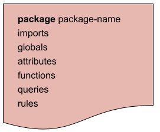

= Drools 语法
:toc: manual

== Rules file structure

== Keywords

.*Hard keywords*
,===
,,

true,false,null
,===

.*Soft keywords*
,===
,,,

lock-on-active,date-effective,date-expires,no-loop,auto-focus,activation-group,agenda-group,ruleflow-group,entry-point,duration,package,import,dialect,salience,enabled,attributes,rule,extend,when,then,template,query,declare,function,global,eval,not,in,or,and,exists,forall,accumulate,collect,from,action,reverse,result,end,over,init
,===

== Comments

[source, text]
.*Single line comment*
----
// this is a single line comment
----

[source, text]
.*Multi-line comment*
----
/* 
this is a multi-line comment
*/
----

