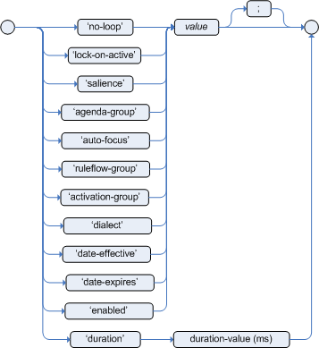

= Attribute
:toc: manual
:toc-placement: preamble

.

== 语法

|===
|属性 |默认值 |类型 |描述

|no-loop
|false
|Boolean
|用来设定是否循环执行规则

|ruleflow-group
|null
|String
|

|lock-on-active
|false
|Boolean
|

|salience
|0
|Integer
|定义规则执行的优先级

|agenda-group
|MAIN
|String
|

|auto-focus
|false
|Boolean
|

|
|
|
|

|
|
|
|

|
|
|
|

|
|
|
|

|
|
|
|

|
|
|
|
|===

== no-loop 示例

[source, java]
.*testLoop.drl*
----
package org.drools.examples.loop;

import org.drools.examples.model.Cursor;

rule "no-loop testing"
  no-loop true // will skip loop
  when
    c : Cursor(cur < 10, tmpCur : cur)
  then
    System.out.println(tmpCur);
    c.setCur(c.getCur() + 1);
    update(c);
end
----

link:src/main/resources/org/drools/examples/loop/testLoop.drl[link]

[source, java]
.*Example_Loop.java*
----
KieServices ks = KieServices.Factory.get();
KieContainer kContainer = ks.getKieClasspathContainer();
KieSession kSession = kContainer.newKieSession("ksession-rules-no-loop");
        
Cursor cur = new Cursor(5);
kSession.insert(cur);
kSession.fireAllRules();
kSession.dispose();
----

link:src/main/java/org/drools/examples/Example_Loop.java[link]

== salience 示例

[source, java]
.*testSalience.drl*
----
package org.drools.examples.saliences;

rule "Rule 01"
  salience -100
  when
    eval (true)
  then
    System.out.println("Rule 01");
end

rule "Rule 02"
  when
    eval (true)
  then
    System.out.println("Rule 02");
end

rule "Rule 03"
  salience 100
  when
    eval (true)
  then
    System.out.println("Rule 03");
end
----

link:src/main/resources/org/drools/examples/saliences/testSalience.drl[link]

[source, java]
.*Example_Salience.java*
----
KieServices ks = KieServices.Factory.get();
KieContainer kContainer = ks.getKieClasspathContainer();
KieSession kSession = kContainer.newKieSession("ksession-rules-saliences");
kSession.fireAllRules();
kSession.dispose();
----

link:src/main/java/org/drools/examples/Example_Salience.java[link]

== Partition 示例

[source, java]
.*testPartition.drl*
----
package org.drools.examples.partition;

rule "Rule 01"
  agenda-group "partitionA"
  when
    eval (true)
  then
    System.out.println("Rule 01");
end

rule "Rule 02"
  agenda-group "partitionB"
  when
    eval (true)
  then
    System.out.println("Rule 02");
end
----

link:src/main/resources/org/drools/examples/partition/testPartition.drl[link]

[source, java]
.*Example_Partition.java*
----
KieServices ks = KieServices.Factory.get();
KieContainer kContainer = ks.getKieClasspathContainer();
KieSession kSession = kContainer.newKieSession("ksession-rules-partition");
kSession.getAgenda().getAgendaGroup("partitionB").setFocus();
kSession.fireAllRules();
kSession.getAgenda().getAgendaGroup("partitionA").setFocus();
kSession.fireAllRules();
kSession.dispose();
----

link:src/main/java/org/drools/examples/Example_Partition.java[link]
