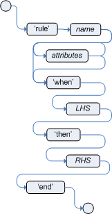

= Rule

== 语法

|===
|顺序 |描述符 |是否必需 |说明
|1
|rule
|是
|

|2
|name
|是
|A rule must have a name, unique within its rule package

|3
|attributes
|否
|

|4
|when
|是
|

|5
|LHS
|否
|The LHS of the rule follows the when keyword

|6
|then
|是
|

|7
|RHS
|否
|The RHS follows the then keyword

|8
|end
|是
|The rule is terminated by the keyword end
|===

== 示例

[source, java]
.*Bank_01.drl*
----
package org.drools.examples.banking;

rule "Rule 01"   
    when
        eval (1==1)
    then
        System.out.println("Rule 01 Works");
end
----

link:src/main/resources/org/drools/examples/banking/Bank_01.drl[link]

[source, java]
.*Bank_02.drl*
----
package org.drools.examples.banking;

rule "Rule 02"   
    when
        $number : Number()
        not Number( intValue < $number.intValue ) 
    then
        System.out.println("Number found with value: " + $number.intValue() ); 
        delete( $number );
end
----

link:src/main/resources/org/drools/examples/banking/Bank_02.drl[link]

[source, java]
.*Bank_03.drl*
----
package org.drools.examples.banking;

rule "Rule 03"   
    when
        Number( $intValue : intValue )
    then
        System.out.println("Number found with value: " + $intValue); 
end
----

link:src/main/resources/org/drools/examples/banking/Bank_03.drl[link]

[source, java]
.*Bank_04.drl*
----
package org.drools.examples.banking;

import org.drools.examples.model.Cashflow;

rule "Rule 04"   
    when
        $cashflow : Cashflow( $date : date, $amount : amount )
        not Cashflow( date < $date)
    then
        System.out.println("Cashflow: "+$date+" :: "+$amount);  
        delete($cashflow);
end
----

link:src/main/resources/org/drools/examples/banking/Bank_04.drl[link]

[source, java]
.*Bank_05.drl*
----
package org.drools.examples.banking;

import org.drools.examples.model.TypedCashflow;

rule "Rule 05"  
    when
        $cashflow : TypedCashflow( $date : date,
                                   $amount : amount,
                                   type == TypedCashflow.CREDIT )
        not TypedCashflow( date < $date,
                           type == TypedCashflow.CREDIT )
    then
        System.out.println("Credit: "+$date+" :: "+$amount);   
        delete($cashflow);
end
----

link:src/main/resources/org/drools/examples/banking/Bank_05.drl[link]

[source, java]
.*Bank_06.drl*
----
package org.drools.examples.banking;

import org.drools.examples.model.AllocatedCashflow;

rule "Rule 06 - Credit"  
    when
        $cashflow : AllocatedCashflow( $account : account,
                                       $date : date, $amount : amount,
                                       type==TypedCashflow.CREDIT )
        not AllocatedCashflow( account == $account, date < $date)
    then
        System.out.println("Credit: " + $date + " :: " + $amount);     
        $account.setBalance($account.getBalance()+$amount);
        System.out.println("Account: " + $account.getAccountNo() + " - new balance: " + $account.getBalance());          
        delete($cashflow);
end

rule "Rule 06 - Debit"  
    when
        $cashflow : AllocatedCashflow( $account : account,
                            $date : date, $amount : amount,
                            type==TypedCashflow.DEBIT )
        not AllocatedCashflow( account == $account, date < $date)
    then
        System.out.println("Debit: " + $date + " :: " + $amount);      
        $account.setBalance($account.getBalance() - $amount);
        System.out.println("Account: " + $account.getAccountNo() + " - new balance: " + $account.getBalance());           
        delete($cashflow);
end
----

link:src/main/resources/org/drools/examples/banking/Bank_06.drl[link]

[source, java]
.*Example_Banking.java*
----
KieServices ks = KieServices.Factory.get();
KieContainer kContainer = ks.getKieClasspathContainer();
KieSession kSession = kContainer.newKieSession("ksession-rules-banking");
        
Number[] numbers = new Number[] {new Integer(3), new Integer(1), new Integer(4), new Integer(1), new Integer(5)};
for(int i = 0 ; i < numbers.length ; i ++) {
       kSession.insert(numbers[i]);
}
        
Cashflow[] cashflows = new Cashflow[]{
        new Cashflow(new SimpleDate("01/12/2017"), 300.00),
        new Cashflow(new SimpleDate("05/01/2017"), 100.00),
        new Cashflow(new SimpleDate("11/07/2017"), 500.00),
        new Cashflow(new SimpleDate("07/01/2017"), 800.00),
        new Cashflow(new SimpleDate("02/10/2017"), 400.00)
};
for(int i = 0 ; i < cashflows.length ; i ++) {
       kSession.insert(cashflows[i]);
}
        
TypedCashflow[] typedCashflows = new TypedCashflow[]{
      	new TypedCashflow(new SimpleDate("01/12/2017"), 300.00, TypedCashflow.CREDIT),
        new TypedCashflow(new SimpleDate("05/01/2017"), 100.00, TypedCashflow.CREDIT),
        new TypedCashflow(new SimpleDate("11/07/2017"), 500.00, TypedCashflow.CREDIT),
        new TypedCashflow(new SimpleDate("07/01/2017"), 800.00, TypedCashflow.DEBIT),
        new TypedCashflow(new SimpleDate("02/10/2017"), 400.00, TypedCashflow.DEBIT)
};
for(int i = 0 ; i < typedCashflows.length ; i ++) {
        kSession.insert(typedCashflows[i]);
}
        
Account acc1 = new Account(1);
Account acc2 = new Account(2);
AllocatedCashflow[] allocatedCashflows = new AllocatedCashflow[] {
        new AllocatedCashflow(acc1,new SimpleDate("01/01/2017"), 300.00, TypedCashflow.CREDIT),
        new AllocatedCashflow(acc1,new SimpleDate("05/02/2017"), 100.00, TypedCashflow.CREDIT),
        new AllocatedCashflow(acc2,new SimpleDate("11/03/2017"), 500.00, TypedCashflow.CREDIT),
        new AllocatedCashflow(acc1,new SimpleDate("07/02/2017"), 800.00, TypedCashflow.DEBIT),
        new AllocatedCashflow(acc2,new SimpleDate("02/03/2017"), 400.00, TypedCashflow.DEBIT),
        new AllocatedCashflow(acc1,new SimpleDate("01/04/2017"), 200.00, TypedCashflow.CREDIT),
        new AllocatedCashflow(acc1,new SimpleDate("05/04/2017"), 300.00, TypedCashflow.CREDIT),
        new AllocatedCashflow(acc2,new SimpleDate("11/05/2017"), 700.00, TypedCashflow.CREDIT),
        new AllocatedCashflow(acc1,new SimpleDate("07/05/2017"), 900.00, TypedCashflow.DEBIT),
        new AllocatedCashflow(acc2,new SimpleDate("02/05/2017"), 100.00, TypedCashflow.DEBIT) 
};
for(int i = 0 ; i < allocatedCashflows.length ; i ++) {
        kSession.insert(allocatedCashflows[i]);
}
        
kSession.fireAllRules();
kSession.dispose();
----

link:src/main/java/org/drools/examples/Example_Banking.java[link]

