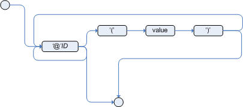

= Type Declaration
:toc: manual
:toc-placement: preamble

.

== 语法

.*meta_data*

.*Type Declaration*
image::src/img/drools-reference-typeDeclaration-2.png[]

NOTE: 类型声明主要有两个目的：声明一个新类型，声明元数据

== 声明新类型示例

[source, java]
.*testDeclareNewTypes.drl*
----
package org.drools.examples.newTypes;

import java.util.Date

global java.util.List myGlobalList;

declare Address
  number : int
  streetName : String
  city : String
end

declare Person
  name : String
  dateOfBirth : Date
  address : Address
end

declare enum DaysOfWeek
  SUN,MON,TUE,WED,THU,FRI,SAT;
end

declare Employee
  name : String
  dayOff : DaysOfWeek
end

rule "Declaing new Types"
  when
    eval(true)
  then
    Address address = new Address();
    address.setNumber(100);
    address.setStreetName("Bing He Road");
    address.setCity("LanZhou");
    Person person = new Person();
    person.setName("Bob");
    person.setAddress(address);
    myGlobalList.add(address);
    insert(person);
end

rule "Using a declared Type"
  when
    $p : Person( name == "Bob" )
  then
    myGlobalList.add($p);
    Employee employee = new Employee();
    employee.setName("Mr Yung");
    employee.setDayOff(DaysOfWeek.WED);
    insert(employee);
end

rule "Using a declared Enum"
  when
    $e : Employee( dayOff == DaysOfWeek.WED )
  then
    myGlobalList.add($e);
end
----

link:src/main/resources/org/drools/examples/newTypes/testDeclareNewTypes.drl[link]

[source, java]
.*Example_DeclaringNewTypes.java*
----
KieServices ks = KieServices.Factory.get();
KieContainer kContainer = ks.getKieClasspathContainer();
KieSession kSession = kContainer.newKieSession("ksession-rules-newTypes");
List<Object> list = new ArrayList<>();
kSession.setGlobal( "myGlobalList", list );
kSession.fireAllRules();
kSession.dispose();
list.forEach(obj -> System.out.println("class: " + obj.getClass() + ", value: " + obj));
----

link:src/main/java/org/drools/examples/Example_DeclaringNewTypes.java[link]

== 元数据表

|===
|类型 |Level

|@role( <fact / event> )
|Class

|@typesafe( <boolean> )
|Class

|@timestamp( <attribute name> )
|Class

|@duration( <attribute name> )
|Class

|@expires( <time interval> )
|Class

|@propertyChangeSupport
|Class

|@propertyReactive
|Class

|@key
|Attribute

|@position
|Attribute

|===

== 元数据声明示例

[source, java]
.*testMetadata.drl*
----
package org.drools.examples.metadata;

import java.util.Date
import org.drools.examples.model.Customer;

declare Address
  @author( Kylin )
  @dateOfCreation( 23-Oct-2017 )
  
  number : int @key @position(0)
  streetName : String @key @position(1)
  city : String @key @position(2)
end

declare Person
  @author( Kylin )
  @dateOfCreation( 23-Oct-2017 )

  name : String @key @maxLength( 30 ) @position(0)
  dateOfBirth : Date @key @position(1)
  address : Address 
end

declare Customer
  @author( Kylin )
  @dateOfCreation( 23-Oct-2017 )
end

declare GoldenCustomer extends Customer
  @author( Kylin )
  @dateOfCreation( 23-Oct-2017 )
  
  priority : int
end

rule "Declaring Metadata"
  when
    eval(true)
  then
    Person person = new Person("Bob", new Date());
    Customer customer = new Customer();
    System.out.println(person);
    System.out.println(customer);
end

rule "Accessing Declared Types from the Application Code"
  when
    $c : GoldenCustomer(id == 101)
  then
    System.out.println($c);
end
----

link:src/main/resources/org/drools/examples/metadata/testMetadata.drl[link]

[source, java]
.*Example_Metadata.java*
----
KieServices ks = KieServices.Factory.get();
KieContainer kContainer = ks.getKieClasspathContainer();
KieBase kbase = kContainer.getKieBase("rules-metadata");
KieSession kSession = kbase.newKieSession();
        
FactType factType = kbase.getFactType("org.drools.examples.metadata", "GoldenCustomer");
Object obj = factType.newInstance();
factType.set(obj, "id", 101);
factType.set(obj, "name", "Bob");
factType.set(obj, "discription", "this is a discription");
factType.set(obj, "priority", 1);
kSession.insert(obj);
        
kSession.fireAllRules();
kSession.dispose();
----

link:src/main/java/org/drools/examples/Example_Metadata.java[link]
